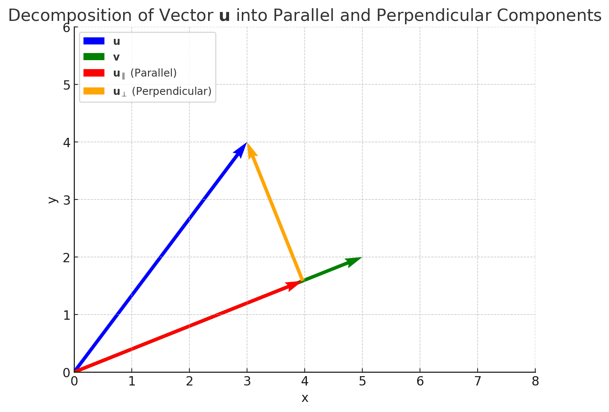

The inner product is a binary operation that maps two vectors (formal definition of "linear objects") to a scalar value. It extends the notion of dot product to more than geometric vectors ("vectors in \( \mathbb{R}^n \), also called Euclidean vectors"), such as functions.

Since, for geometric vectors, the inner product is often called the dot product, I always wondered where the name "inner product" came from.

While watching the video [Addendum to A Swift Introduction to Geometric Algebra](https://www.youtube.com/watch?v=0bOiy0HVMqA) by sudgylacmoe. I figured I would make a short post about it.

Based on the illustration, the inner product involves the component of the vector "inside" the other vector, that is, the component of the vector that is aligned in the same direction as the other vector. You take this component and multiply it by the corresponding component of the other vector to form a scalar.

The outer product is the same thing, but with the "outside" component, or specifically, the orthogonal component. You take the component of the vector that is orthogonal to the other vector and multiply it by the corresponding component of the other vector to form a bivector with the result as its area.