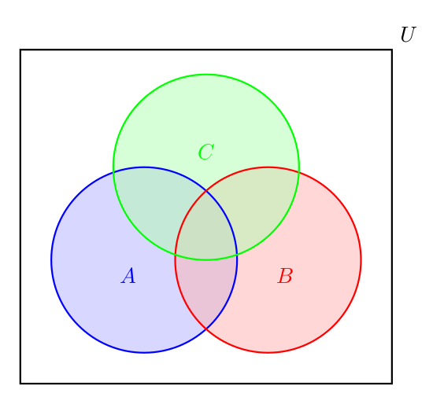

Probability is an elusive concept, much like time in Augustine's Confessions—we understand it until asked to define it. From ancient games to modern quantum mechanics, probability has puzzled and fascinated great minds. Even today, its true meaning is debated: is it about counting, measuring uncertainty, or something inherent in the universe? Regardless, we need probability to solve real-world problems.

Modern probability theory, built on set theory, boolean algebra, and measure theory, often feels disconnected from practical applications. This abstraction is problematic because humans are naturally adept with numbers but struggle with abstract set operations. Our hard-earned mathematical intuition seems to evaporate when faced with these abstract concepts.

Bruno de Finetti's insight bridges this gap by interpreting probability as expectation, effectively translating the language of sets into the language of numbers. He uses indicator functions to convert sets into numbers, making set operations into numerical calculations. For example, the intersection of sets becomes multiplication of indicators, and the complement of a set becomes a simple subtraction.

De Finetti's notation treats sets and their indicator functions as the same, allowing us to derive complex set and probability formulas using basic algebra. This approach simplifies understanding and application, making probability theory more intuitive and accessible.

In probability theory, De Finetti's key equation is \( P(A) = E[A] \), where \( E[A] \) is the expectation of the indicator function \( \mathbb{1}_A \). This equation shows that probabilities are just averages, making expectation a linear mapping within the familiar realm of algebra.

### Bridging Sets and Numbers

In traditional probability theory, we start with a probability space \((\Omega, \mathcal{F}, P)\). Here, \(\Omega\) is our sample space (all possible outcomes), \(\mathcal{F}\) is a collection of events we can assign probabilities to, and \(P\) is the probability measure itself. For a coin flip, \(\Omega\) might be \(\{H, T\}\), while \(\mathcal{F}\) would include \(\{H\}\), \(\{T\}\), \(\{H, T\}\), and \(\emptyset\). In this perspective, an event is a set. How do we convert this to a number?

Random variables, functions from \(\Omega\) to \(\mathbb{R}\), extract numbers from our experiments (outcomes). Indicator functions, a specific type of random variable, come to our rescue. For any event \(A\), we define:

$$ \mathbb{1}_A(x) = \begin{cases} 1 & \text{if } x \in A \\ 0 & \text{otherwise} \end{cases} $$

De Finetti's approach treats sets and their indicator functions as the same, even in notation, writing $1_A = A$. This allows us to bridge our intuition from algebra to probability and set theory.

This is just a notational convenience, but even if you prefer writing the indicator function explicitly, thinking in terms of indicator functions is extremely powerful.

### Set Operations as Algebra

This simple function transforms sets into numbers. Suddenly, set operations become numerical calculations. Let's see some examples:

1. **Intersection of Sets**:
   $$ \mathbb{1}_{A \cap B} = \mathbb{1}_A \cdot \mathbb{1}_B $$
   In De Finetti's notation:
   $$ A \cap B = A \cdot B $$

2. **Complement of a Set**:
   $$ A^c = 1 - A $$

Now, you might have seen this picture before:

The standard formulation of the principle of inclusion-exclusion (PIE) is through the *size* of the sets, not the sets themselves:

$$ |A \cup B| = |A| + |B| - |A \cap B| $$

This is unfortunate, because beyond the sizes, it applies to the sets themselves. Previously, we didn't have a clear way to express this. Now, however, we can actually express PIE properly rather than only covering the size of the sets. So here is the formula for the union of 2 sets:

$$ A \cup B = A + B - A \cap B = A + B - A \cdot B$$

Even better: we can now fully derive, using just these two simple formulas, De Morgan's laws and the generalized principle of inclusion-exclusion for multiple sets.

The standard way is pretty involved, having to analyze the properties of the set operations. Let's see how we derive it for free from our knowledge of algebra with De Finetti's notation. 

**De Morgan's Laws**:
1. $$ (A \cup B)^c = A^c \cap B^c $$
2. $$ (A \cap B)^c = A^c \cup B^c $$

Derivation using De Finetti's notation:
1. $$ (A \cup B)^c = 1 - (A + B - A \cdot B) = (1 - A) \cdot (1 - B) = A^c \cap B^c $$
2. $$\begin{aligned} A^c \cup B^c &= (1 - A) + (1 - B) - (1 - A) \cdot (1 - B) \\ &= 1 - (A \cdot B) \\ &= (A \cap B)^c \end{aligned}$$

Using this, checking the identities is literally follows from expanding the algebra. Done with boolean algebra and set operations! How convenient is that?

And the same thing for PIE. Let's find a general formula for the union of $n$ sets. 

Let's look at a Venn diagram of multiple sets:

If we take the complement, we can see a hole left by the union of the sets. And in fact, we can recover this complementary set by taking the intersection of all the complements of the sets. Basically, we puncture a hole within the universe for each set, then take the complement, so we are left with the union of the sets.

Now algebraically, simply by using De Morgan's laws we derived, we can get: 

$$
\begin{aligned}
\bigcup_{i=1}^n A_i &= \left( \bigcap_{i=1}^n A_i^c \right)^c \\
&= 1 - \prod_{i=1}^n (1 - A_i) \\
\end{aligned}
$$

Look at how naturally the principle of inclusion-exclusion emerges, and in such an elegantly compact way! I personally had never seen PIE written in this product form before, only ever seeing the fully expanded version with alternating signs. But this makes it so clear why binomial coefficients appear when the sizes of the sets is the same! The product simply becomes a power of the complement $1 - A_i$. No need for all that weirdly unintuitive induction black magic that cancels out just right to arrive to the answer... just algebra! No need to memorize complicated set formulas - it falls right out of basic arithmetic. 

Not only does this work on set theory, but it works on probability theory too. Probability measures are... weird, to say the least. In some ways it behaves nice, but because it is presented in such an alien environment, it's hard to firmly get a grasp of it without relearning the entire intuition from scratch. But it's not necessary, once again.

### Probability as Expectation

De Finetti's key equation is:
$$ P(A) = E[A] $$
where \( E[A] = E[\mathbf{1}_A] \) is the expectation of the indicator function \( \mathbf{1}_A \). This shows that probabilities are just averages, which is super nice since expectation behaves very well.

Unlike probability measures which can have many different rules in different contexts, expectation is a linear mapping within the familiar realm of algebra. And so, we are once again able to use our intuition from algebra to solve problems in probability theory.

In fact, the properties of probability measure become very easy to derive from the properties of expectation.

### Side Note: Concise Proof of \( E[E[X | Y]] = E[X] \)

1. **Orthogonality Property**: By definition of conditional expectation as the best predictor, the error \( X - E[X | Y] \) is orthogonal to any function of \( Y \):
   \[
   E[(X - E[X | Y]) \cdot h(Y)] = 0 \quad \forall h(Y).
   \]

2. **Special Case**: Choosing \( h(Y) = 1 \) gives:
   \[
   E[X - E[X | Y]] = 0 \implies E[X] = E[E[X | Y]].
   \]

Thus, the law of iterated expectation holds.

### Proving the Expectation of an Indicator Satisfies the Axioms of a Measure

The **expectation of an indicator function**, \(E[\mathbf{1}_A]\), corresponds to the probability of the event \(A\), denoted \(P(A)\). To show that \(P(A) = E[\mathbf{1}_A]\) satisfies the axioms of a measure, we verify the following:

1. **Non-Negativity**: Since \(\mathbf{1}_A(\omega) \in \{0, 1\}\implies \mathbf{1}_A \ge 0 \),
   \[
   P(A) = E[\mathbf{1}_A] = \ge 0.
   \]

2. **Null Event**: For \(A = \emptyset\), \(\mathbf{1}_A(\omega) = 0\), so:
   \[
   P(\emptyset) = E[\mathbf{1}_\emptyset] = 0.
   \]

3. **Countable Additivity**: For disjoint \(\{A_i\}_{i=1}^\infty\), 
   \[
   \mathbf{1}_{\bigcup_{i=1}^\infty A_i} = \sum_{i=1}^\infty \mathbf{1}_{A_i}.
   \]
   Linearity of expectation gives:
   \[
   P\left(\bigcup_{i=1}^\infty A_i\right) = \sum_{i=1}^\infty P(A_i).
   \]

---

### Derived Properties

With indicator functions and properties of expectation, deriving properties of probability measures is *actually* trivial, not the mathematician's "trivial" as in write 3 pages of proofs.

- **Monotonicity**: If \(A \subseteq B\), \(\mathbf{1}_A \leq \mathbf{1}_B\), so:
  \[
  P(A) \leq P(B).
  \]

- **Complement Rule**: \(\mathbf{1}_{A^c} = 1 - \mathbf{1}_A\), so:
  \[
  P(A^c) = 1 - P(A).
  \]

- **Subadditivity**: \(\mathbf{1}_{A \cup B} \leq \mathbf{1}_A + \mathbf{1}_B\), so:
  \[
  P(A \cup B) \leq P(A) + P(B).
  \]

- **Inclusion-Exclusion**: \(\mathbf{1}_{A \cup B} = \mathbf{1}_A + \mathbf{1}_B - \mathbf{1}_{A \cap B}\), so:
  \[
  P(A \cup B) = P(A) + P(B) - P(A \cap B).
  \]

### Chain Rule of Probability via Iterated Expectation

The **chain rule of probability** for events \( A, B, C \) is:
\[
P(A \cap B \cap C) = P(A) \cdot P(B | A) \cdot P(C | A \cap B).
\]

We derive this using the **law of iterated expectation**, which states:
\[
E[X] = E[E[X | Y]].
\]

---

1. **Start with the definition of probability**:
   \[
   P(A \cap B \cap C) = E[\mathbf{1}_{A \cap B \cap C}],
   \]
   where \( \mathbf{1}_{A \cap B \cap C} \) is the indicator function for the event \( A \cap B \cap C \).

2. **Apply the law of iterated expectation**:
   \[
   P(A \cap B \cap C) = E[E[\mathbf{1}_{A \cap B \cap C} | B, C]].
   \]

3. **Simplify the inner expectation**:
   Using the property of indicator functions, \( \mathbf{1}_{A \cap B \cap C} = \mathbf{1}_A \cdot \mathbf{1}_{B \cap C} \). Conditioning on \( B \) and \( C \), only \( \mathbf{1}_A \) is random, so:
   \[
   E[\mathbf{1}_{A \cap B \cap C} | B, C] = \mathbf{1}_{B \cap C} \cdot E[\mathbf{1}_A | B, C].
   \]

4. **Substitute back into the expectation**:
   \[
   P(A \cap B \cap C) = E[\mathbf{1}_{B \cap C} \cdot E[\mathbf{1}_A | B, C]].
   \]

5. **Extract \( \mathbf{1}_{B \cap C} \)**:
   The outer expectation averages over \( B \cap C \), so:
   \[
   E[\mathbf{1}_{B \cap C} \cdot E[\mathbf{1}_A | B, C]] = E[\mathbf{1}_{B \cap C}] \cdot E[\mathbf{1}_A | B, C].
   \]

   Thus:
   \[
   P(A \cap B \cap C) = P(B \cap C) \cdot P(A | B, C).
   \]

6. **Expand \( P(B \cap C) \)**:
   Using the chain rule for two events, derived similarly:
   \[
   P(B \cap C) = P(C) \cdot P(B | C).
   \]

7. **Combine everything**:
   Substitute \( P(B \cap C) \) into the expression:
   \[
   P(A \cap B \cap C) = P(C) \cdot P(B | C) \cdot P(A | B, C).
   \]

This reasoning extends naturally to \( n \)-events:
\[
P(A_1 \cap A_2 \cap \cdots \cap A_n) = P(A_1) \cdot P(A_2 | A_1) \cdot \cdots \cdot P(A_n | A_1 \cap \cdots \cap A_{n-1}).
\]

Adding exercises to your blog post can help readers solidify their understanding and apply the concepts they've learned. Here are some exercise ideas that align with the content of your post:

### Exercises

1. **Indicator Functions and Set Operations**:
   - Define indicator functions for the following sets: \( A = \{1, 2, 3\} \), \( B = \{2, 3, 4\} \), and \( C = \{3, 4, 5\} \).
   - Calculate the indicator functions for \( A \cap B \), \( A \cup B \), and \( A^c \) (assuming the universal set \( \Omega = \{1, 2, 3, 4, 5\} \)).

2. **Probability as Expectation**:
   - Given a probability space \( (\Omega, \mathcal{F}, P) \) with \( \Omega = \{1, 2, 3, 4\} \), \( \mathcal{F} \) being the power set of \( \Omega \), and \( P \) defined as \( P(\{1\}) = 0.1 \), \( P(\{2\}) = 0.2 \), \( P(\{3\}) = 0.3 \), \( P(\{4\}) = 0.4 \):
     - Calculate the expectation \( E[\mathbb{1}_A] \) for \( A = \{1, 3\} \).
     - Verify that \( P(A) = E[\mathbb{1}_A] \).

3. **De Morgan's Laws**:
   - Use De Finetti's notation to prove De Morgan's laws for three sets \( A \), \( B \), and \( C \):
     - \( (A \cup B \cup C)^c = A^c \cap B^c \cap C^c \)
     - \( (A \cap B \cap C)^c = A^c \cup B^c \cup C^c \)

4. **Principle of Inclusion-Exclusion**:
   - Use De Finetti's notation to derive the principle of inclusion-exclusion for three sets \( A \), \( B \), and \( C \):
     - \( A \cup B \cup C = A + B + C - A \cdot B - B \cdot C - C \cdot A + A \cdot B \cdot C \)

5. **Conditional Expectation**:
   - Given random variables \( X \) and \( Y \) with \( E[X] = 2 \) and \( E[X | Y] = Y + 1 \):
     - Calculate \( E[E[X | Y]] \) and verify that it equals \( E[X] \).

### References and Further Reading

- [David Pollard - A User's Guide to Measure Theoretic Probability (Chapter 1: Motivation)](http://www.stat.yale.edu/~pollard/Courses/600.spring06/Handouts/Chapter1.pdf)
- [Bruno de Finetti - Wikipedia](https://en.wikipedia.org/wiki/Bruno_de_Finetti)
- [De Finetti's Coherence Principle](https://plato.stanford.edu/entries/probability-interpret/)