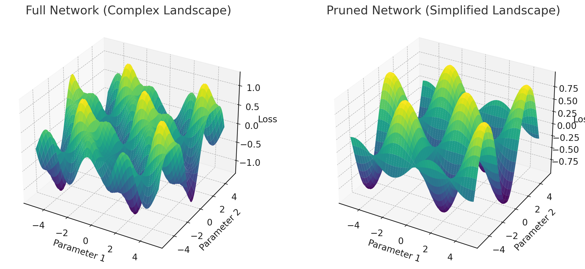

# The Lottery Ticket Hypothesis

This chart shows a simplified 3D landscape illustrating the loss function of the neural network.
- Left: The original "full" network, which is overparameterized.
- Right: The pruned network, which has less bumps and is cheaper to optimize. However, in some points, it can be less "certain" than the original network, which explains the higher training loss despite the higher accuracy on the test set. You can see it interpolating approximately rather than partially overfitting.

## Lottery Ticket Hypothesis Overview

The Lottery Ticket Hypothesis, proposed by Frankle and Carbin (2019), suggests that within large neural networks, there exist smaller subnetworks that can be trained to achieve similar or even better performance than the full network.

## Visual Representation

The image shows two 3D plots:
1. Full Network (Complex Landscape)
2. Pruned Network (Simplified Landscape)

#### Full Network (Left Plot)
- Represents a large, overparameterized neural network
- Complex loss landscape with many peaks and valleys
- More parameters (x and y axes) and wider range of loss values (z-axis)

#### Pruned Network (Right Plot)
- Represents a smaller, pruned subnetwork
- Simplified loss landscape with smoother contours
- Fewer parameters but maintains overall structure of important features

## Pruning Process

1. Train the full network
2. Identify important connections (the "winning ticket") by training for a short time, to notice which weights are most affected by the optimization process (often SGD-based, but I suspect this can be adapted to other optimizers)
3. Prune less important connections (weights with lowest magnitude)
4. Re-initialize to the original weights, but zero out the pruned weights using a mask
5. Retrain the remaining subnetwork
6. Repeat.

## Benefits of Pruning

1. Reduced computational cost
2. Lower memory requirements
3. Potential for improved performance

## Challenges

1. As described in the paper, this process is harder with deeper networks. It requires more care such as warming up the learning rate, so there is a need for tuning hyper-parameters

## Implications of the Hypothesis

Efficiency: Smaller networks require less computation and memory. Previous pruning methods were only applied post-training: however, this paper explains how to also use it before training, which is a huge advantage because training is often times very, very expensive as the models get larger.

Generalization: Pruned networks may generalize better due to reduced overfitting due to a simpler loss landscape (or whatever other benchmark that can yield a measure of performance), as illustrated in the above image. This makes things simpler to work with, giving it just the right amount of flexibility to generalize well without overfitting nor underfitting.

Interpretability: Simpler models are often easier to understand and analyze (although in practice, a human cannot distinguish the difference between 1 million and 10 million parameters so...)

The paper mentions that this work encourages the design of better architectures that are more sparse. In addition, if you're able to leverage the features of your initial randomized landscape to your advantage during training, this incentivizes better initialization strategies. 

Rather than randomizing weights arbitrarily, certain initializations clearly favor certain features, and pruning can be used to remove these non-favored features.

If, one day, we're able to figure out how to just make winning tickets pop up by initializing it well by a carefully designed initialization strategy, then I think it will be breathtaking. For instance, some are working on creating neural networks not by conventional training techniques from scratch (randomized initial weights), but directly using diffusion models to generate them.