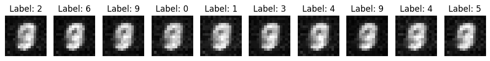

# Teaching Machines to Draw: A Problem Solver's Journey

This blog post is on the topic of using machine learning for image generation. However, its goal is not to serve as a comprehensive guide to the field, nor a formal treatise on the subject. It is not even intended to be historically accurate, or to teach you about the mathematical formulas behind the techniques.

Instead, it is a fictional story written from the perspective of a curious explorer who is attempting to solve a challenging problem. The article is meant to be an example application of general problem-solving techniques to a specific domain, to make you live through the journey of its discovery process.

In particular, I will follow the structure of the points listed out in the post [How to Unstuck Yourself]() on approaching unfamiliar hard problems.

Here is an outline of common strategies for approaching a new problem:

1. Diagnose the problem type
    1. Identify existing solutions to similar problems
2. Formulate the problem, clearly and explicitly
    1. Write down the problem statement in precise mathematical notation
3. Experiment and iterate
    1. Modify the constraints
    2. Play with small cases
    3. Use heuristics to approximate relevant quantities
    4. Identify potential patterns
4. Leverage bounds and constraints
5. Use mathematical identities and theorems
6. Avoid brute force with patterns
7. Divide and conquer
8. Verify and refine

## Understanding Image Creation

We apply 1. Diagnose the problem type. Our goal is to generate new images from scratch using machine learning techniques. So, this is an ML generative problem. Related fields are:

1. Machine learning
2. Art creation

What do we observe?

1. Machine learning: Suppose we don't already know about generative ML strategies. What did we have at that point? Well, we had pretty much solved classification tasks, so that we can classify images into categories. In particular, we know that convolutions are very effective at compressing images while capturing local structure. Hence, we can probably use a similar approach to generate images.

2. Art creation: as a first step, we might try to mimic what we already have: human artists. An artist might:
- Begin with a rough sketch to capture the overall composition
- Gradually refine details, moving between different parts of the image
- Make mistakes, erase, and adjust
- Work at different levels of detail simultaneously

This is what we have so far. Once we clearly define our goals, we will think of how we can leverage this existing knowledge.

## Defining Our Challenge

For step 2, we precisely formulate the problem. Our first instinct might be to write something like "create a program that can generate images." But this is too vague. What exactly do we mean by "generate"? What kind of images? We need to be more precise.

After some thought, we might refine this to: **"Create a function that takes a description (like 'cat' or 'house') and produces a corresponding image."** This is better, but we quickly realize there's still a problem. If our function only takes a description as input, it would always generate the exact same cat or house for the same description. That's not what we want – we need variety!

This leads us to an important insight: we need some source of randomness. Just like how two artists given the same prompt will create different illustrations, our function needs some random input to create variety. For instance, we could approach this by adding a random seed just like for world generation in Minecraft.

Now we can write our goal more precisely. We want to find a parameterized function \( f \) that takes:

1. A description or label \( x \) (could be text, a category label, etc.)
2. A set of parameters \( \theta \) (weights)
3. A random vector \( \overline{\underline Z} \) (our source of variation)

and produces an image \( y \):

\[
y = f(x, \theta, \overline{\underline Z}). \quad \text{where } y \in \mathbb{R}^{h \times w \times c}.
\]

Here:
- \( h \) and \( w \) are the height and width of our image in pixels,
- \( c \) is the number of color channels (e.g., 3 for RGB images).

Each pixel value is typically normalized to fall between 0 and 1. The introduction of \( \overline{\underline Z} \) is crucial: by sampling different values of \( \overline{\underline Z} \) from some distribution (typically a standard normal distribution, \( \overline{\underline Z} \sim \mathcal{N}(0, I) \)), we can generate different variations of images for the same description \( x \). This is analogous to how Minecraft uses a random seed to generate different but coherent worlds – the seed provides the variation, while the game's rules ensure the output makes sense.

## The Role of Structure

Can we find structure and symmetries in our problem to improve efficiency? Certainly. As we think about moving from simple shapes to complex images, we notice something important. Let's suppose you have an image of an animal in nature. The pixels composing the animal will almost always have regular patches of nearly the same color. The same goes for grass, trees, skies, etc. Hence, images have inherent structure at multiple scales: 
- Local structure: Nearby pixels are often similar in color and intensity
- Mid-level structure: Objects have consistent textures and patterns
- Global structure: Objects have meaningful spatial relationships with each other

This observation will be crucial when we start designing our solution. Any successful approach will need to handle all these levels of structure simultaneously.

## Understanding the Space of Images

Before we jump into machine learning techniques, let's think about what makes an image "valid" or "realistic." Consider a $28\times 28 = 784$ pixel grayscale image just like in the MNIST dataset for handwritten digits, each pixel having intensity from $0$ to $255$. Each pixel can take $256$ possible values, giving us $256^{784}$ possible images, an intractably enormous number. But only a tiny fraction of these would look like anything meaningful to a human.

This leads to a key insight: valid images lie on some kind of lower-dimensional manifold within this vast space of possible pixel combinations. Our task isn't just to generate any image - it's to generate images that lie on this manifold. This is the idea of the **manifold hypothesis**, which will lead us to the idea of a **latent space**.

## First Attempts

Now that we've developed some intuition about the problem, let's start with the simplest possible case: generating small black and white images, perhaps $16\times 16$ pixels in size. Why this choice?
- Binary pixels (black or white) simplify the output space
- Small size makes computation manageable
- We can easily visualize and debug the results
- Many interesting challenges remain present even at this scale

After spending time understanding the problem, it's natural to look at our existing toolbox. We know machine learning is good at recognizing patterns and making predictions. Could we use these capabilities to generate images?

After some thought, we already have image data for classification tasks, why don't we just use that as training data? So, for instance, we could use MNIST as an example to try to generate handwritten digits.

The most straightforward approach might be to create a function that maps from our inputs (a description and some random values for variety) directly to the pixels of an image. We're familiar with neural networks that can learn complex mappings, so let's try that first.

Our first idea is to generate small, low-resolution images (for instance, \(16\times16\) pixels) using a **Multi-Layer Perceptron (MLP)**. The motivation is to see whether a basic neural network can learn to map a random noise vector (plus a digit label) to a coherent image of that digit. This is a natural, straightforward first step to confirm that the idea of “random seed \(\rightarrow\) image” can work at all.

1. **Why MLP?**  
   - It’s a classic neural network approach that can approximate complex functions.
   - It’s easy to implement, making it ideal for a proof-of-concept.

2. **Key Inputs**  
   - **Digit label** (one-hot encoded): e.g., a 10-dimensional vector for digits 0–9.
   - **Random noise**: e.g., a 100-dimensional Gaussian vector for variability.

3. **Key Output**  
   - A flattened \(16\times16 = 256\)-dimensional vector, which we then reshape into a 2D image.

4. **Loss Function**  
   - We try **Mean Squared Error (MSE)** between the generated image and a real image of the same digit, treating it like a regression problem.  
We feed random noise + label into this MLP, train it to reproduce downsampled MNIST digits, and observe the output.

Okay, then let's try it. Example Python code can be found in the [appendix](#basic-mlp).

### Results: Uh... What Happened?

<figure style="display: flex; flex-direction: column; align-items: center;">
    
    <figcaption>Generated images of MNIST digits by a simple MLP</figcaption>
</figure>

After training, the generated samples look **somewhat** like digits. We can see that a shape is forming in the middle with the outside empty, as we would expect. But there are some things that stand out as… odd:

1. **Blurriness**: The digits don’t look sharp. They seem fuzzy, like the network can’t commit to strong lines or distinct shapes.  
2. **Similarity Across Labels**: Strangely, the digits look **almost identical** regardless of the label. There are differences, sure, but they aren’t as dramatic as we’d expect for numbers as distinct as “1” and “8.”

This is both exciting (we generated *something*) and frustrating (it’s not quite right).

---

### Interpretation: What Might Be Happening?

To make sense of these results, we need to think carefully about what the network is doing during training. Here are some possible explanations:

1. **Blurriness**  
   The network is minimizing the **Mean Squared Error (MSE)** loss, which compares each pixel in the generated image to the corresponding pixel in a real image. If the network isn’t confident about what to draw, it might settle for “average” pixel values, creating smooth, blurry outputs. For example:
   - If the training data contains multiple ways to draw the same digit (e.g., a curly “2” vs. a straight “2”), the network might blend them together to minimize the average error.
   - This averaging effect is a known limitation of MSE loss—it doesn’t reward sharp, distinct features.

2. **Similarity Across Labels**  
   This might suggest the network isn’t fully using the label information.  
   - Remember, we’re giving it one-hot encoded labels as part of the input. But if the generator isn’t paying attention to these labels, it might just be generating “generic digit-like shapes” without strong variation between labels.
   - Could the noise component be overpowering the label signal? Or maybe the network architecture (an MLP) struggles to properly distinguish the label inputs from the noise.

3. **Limited Spatial Understanding**  
   An MLP processes the image as a flat vector of pixels, ignoring the natural 2D structure of images. It treats each pixel as independent of its neighbors. This might explain why the outputs lack the crispness or structure we expect from real digits.

---

### What Do We Do With This?

So, what's going wrong, exactly? And what should we try next?

1. **Is the Problem in the Loss?**  
   If the network is producing blurry outputs, does that mean the loss function (MSE) is the issue? Or is it the data, or even the architecture? How might we check this?

2. **Are We Using the Label Input Correctly?**  
   Why do the generated digits look so similar across different labels? Is the label information not getting through? Maybe we should dig into how the input data (noise + label) is being processed.

3. **Can the Network Handle Images at All?**  
   This is an MLP. It’s not designed for images in the same way that a convolutional network is. So maybe we should try a different architecture, like a CNN?

--- 

By exploring these questions, we can decide where to focus our efforts next. It’s tempting to jump straight to known solutions (like switching to a convolutional network), but first, we should try to fully understand why this first attempt isn’t working as expected. That way, our next steps will be guided by insight, not guesswork.

We also notice another problem: when we try to generate larger images, our simple approach becomes incredibly expensive. The number of connections in our network grows explosively with image size. It's like trying to coordinate an ever-growing team of pixel-artists, where each artist needs to communicate with every other artist. No wonder it becomes unmanageable!

These challenges point us toward some key principles for our next attempt:
1. We need to handle spatial relationships more intelligently
2. We need a more efficient way to process larger images
3. We need better ways to maintain variety in our outputs

Looking at these principles, we might remember that image classification networks faced similar challenges. They solved them using convolutions – a way of processing images that looks at small regions at a time, similar to how an artist focuses on one area while staying aware of the whole composition.

[Continue with how this insight leads to the next iteration...]

The key is that we're discovering these solutions through experimentation and observation, rather than just implementing known techniques. Each advancement comes from identifying and addressing specific limitations we encounter.

### The First Bottleneck: Lack of Spatial Structure

The fully connected nature of our MLP treats every pixel as independent. But images aren’t just collections of independent pixels—they have **spatial structure**. Nearby pixels are more related than distant ones. For instance:
- The strokes in a digit are connected.
- Small changes in one part of the image often affect neighboring regions.

This realization brings us to a critical insight: our model needs to respect the spatial relationships in images. How do we do this? By introducing **local connectivity** through **convolutional layers**, which is where our journey continues.

## Breaking Through: Discovering Spatial Structure

In our first attempt, we used a fully connected network to map inputs (label \(x\) and random noise \(z\)) directly to images. While this approach demonstrated that teaching a machine to generate images is possible in principle, it also revealed significant limitations: 

1. **Parameter Explosion**: The number of parameters grows quadratically with image size, making it infeasible for higher resolutions.
2. **Blurry Outputs**: The generated images lacked sharp, coherent details.
3. **No Spatial Awareness**: The network treats all pixels as equally related, ignoring the local dependencies that make images meaningful.

These issues force us to confront an important question: **How can we encode the spatial structure of images into our models?**

---

### The Insight: Local Relationships in Images

To generate better images, we need to consider how images are structured. Images aren't just collections of unrelated pixels—they have **local dependencies**. For example:

- In a handwritten digit, neighboring pixels along a stroke are closely related.
- The value of one pixel depends more strongly on nearby pixels than on distant ones.

This insight suggests that our model should focus on **local connections** rather than treating all pixels equally. This leads us to a breakthrough idea: **convolutions.**

---

## The Idea of Convolutional Layers

Convolutions are a mathematical operation that processes data locally, making them ideal for image generation. Here’s how they work:

1. **Local Processing**:
   - A convolutional filter (or kernel) is a small matrix, typically \(3 \times 3\) or \(5 \times 5\).
   - The filter slides over the image, computing a weighted sum of pixel values within its local region.
   - Mathematically, for a filter \(\mathbf{K} \in \mathbb{R}^{k \times k}\) and an input image \(\mathbf{I} \in \mathbb{R}^{h \times w}\), the convolution operation is:
     \[
     (\mathbf{I} * \mathbf{K})(i, j) = \sum_{u=1}^{k} \sum_{v=1}^{k} \mathbf{K}(u, v) \cdot \mathbf{I}(i+u-1, j+v-1).
     \]

2. **Shared Parameters**:
   - The same filter is applied across the entire image, drastically reducing the number of parameters compared to fully connected layers.
   - For a \(3 \times 3\) filter, there are only 9 parameters, regardless of the image size.

3. **Preserving Spatial Structure**:
   - Convolutions respect the 2D structure of the image, ensuring that nearby pixels are processed together.
   - This allows the network to capture patterns like edges, corners, and textures.

---

### Building a Convolutional Generator

To incorporate spatial structure, we replace the fully connected layers in our generator with convolutional layers. Here's the new architecture:

1. **Input**:
   - Label: \(x \in \{0, 1\}^{10}\) (one-hot encoded).
   - Noise: \(z \sim \mathcal{N}(0, I_d)\), where \(d = 100\).

2. **Latent Space**:
   - Combine \(x\) and \(z\), then project them into a smaller latent representation.

3. **Upsampling with Convolutions**:
   - Start with a small \(4 \times 4\) grid of features.
   - Use **transposed convolutions** (or deconvolutions) to progressively upsample the grid to the desired image size:
     - \(4 \times 4 \to 8 \times 8 \to 16 \times 16\).
   - At each step, apply a convolutional layer followed by a non-linear activation (e.g., ReLU).

---

### The Math: Transposed Convolutions

A transposed convolution is the reverse of a standard convolution, allowing us to increase the spatial resolution of feature maps. Mathematically:

1. **Input**: Feature map \(\mathbf{F} \in \mathbb{R}^{h \times w \times c}\), where \(c\) is the number of channels.
2. **Filter**: Kernel \(\mathbf{K} \in \mathbb{R}^{k \times k \times c \times c'}\), where \(c'\) is the number of output channels.
3. **Output**: The transposed convolution expands the spatial dimensions of \(\mathbf{F}\) while applying learned weights:
   \[
   \mathbf{F}_{\text{up}} = \mathbf{F} *_{\text{transposed}} \mathbf{K}.
   \]

This process allows the generator to go from a small latent space to a high-resolution image.

---

### Training with Convolutions

We train this convolutional generator using the same MSE loss as before:

\[
\mathcal{L} = \frac{1}{N} \sum_{i=1}^N \|y_i - G(z_i, x_i)\|_2^2,
\]

where \(y_i\) are real images and \(G(z_i, x_i)\) are generated images.

---

### Results: What Changes with Convolutions?

After training the convolutional generator, we immediately notice several improvements:

1. **Sharper Images**:
   - The network generates images with clearer edges and more coherent shapes.
   - Local features, like the curves and strokes in digits, are well-represented.

2. **Better Scaling**:
   - The parameter count no longer explodes with image size. Convolutional filters share weights across the image, keeping the number of parameters manageable.

3. **Spatial Coherence**:
   - The model respects the local structure of images, avoiding disconnected strokes or other artifacts.

---

### New Challenges: Quality and Realism

While convolutional architectures solve many of the problems we encountered with fully connected networks, they introduce new challenges:

1. **Loss Function Limitations**:
   - The MSE loss penalizes pixel-wise differences but doesn’t account for the perceptual quality of the image.
   - For example, a slightly misplaced stroke might lead to a high loss, even if the image looks realistic to humans.

2. **Global Structure**:
   - Convolutions excel at capturing local patterns but struggle with global relationships.
   - For instance, a “9” might have a well-formed top loop, but the tail might be misplaced.

3. **Evaluation**:
   - How do we judge the quality of generated images? Human evaluation is subjective, and pixel-wise metrics like MSE don’t align with human perception.

These challenges set the stage for the next major innovation in image generation: **adversarial training**. By introducing a second network to critique the generator, we can teach our models to produce images that are not only sharp but also realistic.


## Appendix

### Basic MLP

Here is the Python code for a basic MLP setup. In it:
1. **Data Loading**  
   - Load the MNIST CSV files from Kaggle.  
   - Normalize pixel values to \([0, 1]\).  
   - Downsample the original \(28\times28\) images to \(16\times16\).

2. **Generator Model**  
   - A simple `nn.Sequential` in PyTorch (or `keras.Sequential` in TensorFlow) with three `Dense` (fully connected) layers.  
   - Final output uses `Sigmoid` activation to ensure pixel values stay in \([0, 1]\).

3. **Training Loop**  
   - Generate random noise + random labels.  
   - Compute the MSE loss between generated images and real images.  
   - Backpropagate and update the generator parameters using Adam.

4. **Inference**  
   - Once trained, sample new noise + label pairs to produce new digit images.  
   - Plot them using matplotlib to see if they look like digits.

```py
import numpy as np
import pandas as pd
import torch
import torch.nn as nn
import torch.nn.functional as F
import torch.optim as optim
import matplotlib.pyplot as plt

# Load MNIST dataset (Kaggle competition format)
train_data = pd.read_csv('/kaggle/input/digit-recognizer/train.csv')
test_data = pd.read_csv('/kaggle/input/digit-recognizer/test.csv')

# Preprocess the training data
# Normalize pixel values to [0, 1]
X_train = train_data.iloc[:, 1:].values / 255.0
# We won’t need one-hot encoding for training the generator directly,
# but if needed, one can be computed later using torch.nn.functional.one_hot.

# Reshape to (num_samples, 28, 28)
X_train = X_train.reshape(-1, 28, 28)

# Convert to a torch tensor and add channel dimension (needed for interpolation)
X_train_tensor = torch.tensor(X_train, dtype=torch.float32).unsqueeze(1)  # Shape: (N, 1, 28, 28)

# Downsample images to 16x16 using bilinear interpolation
X_train_downsampled = F.interpolate(X_train_tensor, size=(16, 16), mode='bilinear', align_corners=False)
# Remove the channel dimension (now shape: (N, 16, 16))
X_train_downsampled = X_train_downsampled.squeeze(1)

class Generator(nn.Module):
    def __init__(self, input_dim, output_dim):
        super(Generator, self).__init__()
        self.model = nn.Sequential(
            nn.Linear(input_dim, 256),
            nn.ReLU(),
            nn.Linear(256, 512),
            nn.ReLU(),
            nn.Linear(512, output_dim),
            nn.Sigmoid()
        )
    
    def forward(self, x):
        # x shape: (batch_size, input_dim)
        out = self.model(x)
        # Reshape output to (batch_size, 16, 16)
        out = out.view(-1, 16, 16)
        return out

# Define dimensions
latent_dim = 100  # Random noise dimension
label_dim = 10    # One-hot encoded label dimension
input_dim = latent_dim + label_dim  # Total input dimension for the generator
output_dim = 16 * 16  # 16x16 grayscale image

# Instantiate the generator
generator = Generator(input_dim, output_dim)

criterion = nn.MSELoss()
optimizer = optim.Adam(generator.parameters(), lr=0.0002)

def generate_input(num_samples):
    # Create random one-hot labels
    random_labels = torch.randint(0, 10, (num_samples,))
    labels = F.one_hot(random_labels, num_classes=10).float()  # Shape: (num_samples, 10)
    
    # Generate random noise
    noise = torch.randn(num_samples, latent_dim)
    
    # Concatenate labels and noise along the feature dimension
    input_data = torch.cat((labels, noise), dim=1)  # Shape: (num_samples, latent_dim + label_dim)
    return input_data, labels

# Prepare real images for training (using the first 1000 samples)
real_images = X_train_downsampled[:1000]

num_epochs = 50
batch_size = 32

for epoch in range(num_epochs):
    # Generate training input for 1000 samples
    input_data, _ = generate_input(1000)
    
    # Forward pass: generate images from input data
    generated_images = generator(input_data)
    
    # Compute loss between generated images and real images
    loss = criterion(generated_images, real_images)
    
    # Backpropagation and optimization
    optimizer.zero_grad()
    loss.backward()
    optimizer.step()
    
    print(f"Epoch [{epoch+1}/{num_epochs}], Loss: {loss.item():.4f}")

# Generate new images
num_samples = 10
test_input, test_labels = generate_input(num_samples)
generator.eval()  # Set model to evaluation mode
with torch.no_grad():
    generated_images = generator(test_input)

# Visualize generated images
plt.figure(figsize=(10, 2))
for i in range(num_samples):
    plt.subplot(1, num_samples, i + 1)
    plt.imshow(generated_images[i].cpu().numpy(), cmap='gray')
    plt.axis('off')
    plt.title(f"Label: {torch.argmax(test_labels[i]).item()}")
plt.tight_layout()
plt.show()
```