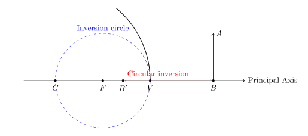

Newton's thin lens/mirror equation is given by:

$$
f^2 = x_o x_i
$$

where $f$ is the focal length, $x_o$ is the object distance to the focal point, and $x_i$ is the image distance to the focal point.

This is exactly the same as the equation for circular inversion:

$$
OB \cdot OB' = r^2
$$

<figure style="display: flex; flex-direction: column; align-items: center;">
    
    <figcaption>Circular Inversion And Thin Lens</figcaption>
</figure>

Related:
https://physics.stackexchange.com/questions/552648/circular-inversion-and-spherical-mirrors