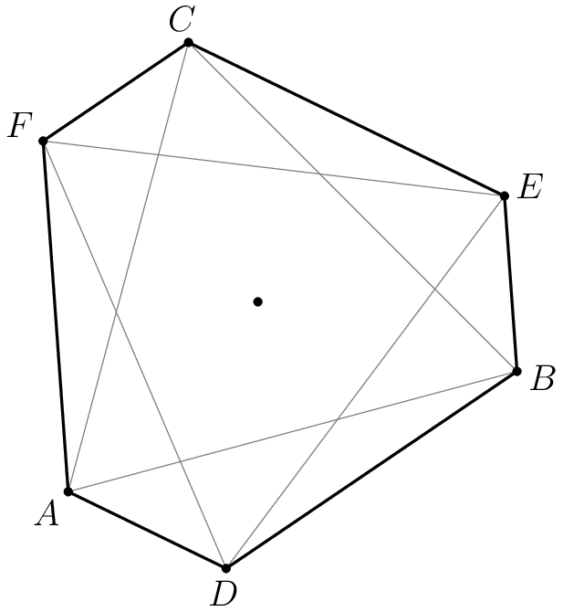

### Problem 1
In a long line of people arranged left to right, the 1013th person from the left is also the 1010th person from the right. How many people are in the line?

$\textbf{(A) } 2021 \qquad\textbf{(B) } 2022 \qquad\textbf{(C) } 2023 \qquad\textbf{(D) } 2024 \qquad\textbf{(E) } 2025$

Sketch the 2 diagrams in an aligned fashion (or draw a single line of points and circle the people involved in the 2 scenarios). Then we see that adding the two gives the full line while overcounting that person once, so $1013+1010-1=\boxed{\textbf{(B) }2022}$.

### Problem 2
What is $10! - 7! \cdot 6!$?

$\textbf{(A) }-120 \qquad\textbf{(B) }0 \qquad\textbf{(C) }120 \qquad\textbf{(D) }600 \qquad\textbf{(E) }720 \qquad$

$$10!-7!6!=7!(10\cdot9\cdot8-6!)=7!(720-720)=\boxed{\textbf{(B) }0}$$

### Problem 3
For how many integer values of $x$ is $|2x|\leq 7\pi?$

$\textbf{(A) }16 \qquad\textbf{(B) }17\qquad\textbf{(C) }19\qquad\textbf{(D) }20\qquad\textbf{(E) }21$

We know $\pi \approx 3.14159 < \frac{22}{7} = 3.\overline{142857}$, meaning $2|x| \le 7\pi < 7\cdot \frac{22}{7} = 22$.

Hence, $|x| < 11$, giving $x \in {-10, \dots, 10}$ and so we have $\boxed{\textbf{(E) }21}$ such integers.

Note: if you don't know about the approximation $\frac{22}{7}$, you can simply do it the normal way with $\pi$'s decimal approximation and just carrying out the computations, say by taking $\pi = 3.14159... < 3.142$.

$|2x| \le 7\pi < 21.994 < 22$, giving the same answer.

### Problem 4
Balls numbered $1,2,3,\ldots$ are deposited in $5$ bins, labeled $A,B,C,D,$ and $E$, using the following procedure. Ball $1$ is deposited in bin $A$, and balls $2$ and $3$ are deposited in $B$. The next three balls are deposited in bin $C$, the next $4$ in bin $D$, and so on, cycling back to bin $A$ after balls are deposited in bin $E$. (For example, $22,23,\ldots,28$ are deposited in bin $B$ at step 7 of this process.) In which bin is ball $2024$ deposited?

$\textbf{(A) }A\qquad\textbf{(B) }B\qquad\textbf{(C) }C\qquad\textbf{(D) }D\qquad\textbf{(E) }E$

Notice that we deposit $k$ balls in the $k$-th step, and we cycle back to the first bin after the $5$-th bin. In fact, the index of the last ball deposited in the $k$-th step is $1+2+\dots+k = \frac{k(k+1)}{2}$, and the first ball comes right after the last ball of the previous step, $1+2+\cdots+(k-1)=\frac{(k-1)k}{2}$.
Hence, in general, ball $n$ is deposited in bin $k \mod 5$ when 

$$1+\cdots+(k-1) = \frac{(k-1)k}{2} < n \le 1+2+\cdots+k = \frac{k(k+1)}{2}.$$

We are interested in ball $n=2024$, so

$$\frac{(k-1)k}{2} < 2024 \le \frac{k(k+1)}{2}$$

$$-k < 4048 - k^2 \le k$$

We know that $4096 = 2^2 \cdot 2^10 = (2^6)^2 = (64)^2$, so k should be close to $64$. Trying it out, we find that $k=64$ works:

$$-64 < 4048 - 4096 = -48 \le 64$$

Hence, the ball $2024$ is deposited in bin $64 \mod 5 \equiv 4$ so $\boxed{\textbf{(D) }D}$.

### Problem 5
In the following expression, Melanie changed some of the plus signs to minus signs:\[1 + 3+5+7+\cdots+97+99\]When the new expression was evaluated, it was negative. What is the least number of plus signs that Melanie could have changed to minus signs?

$\textbf{(A) }14 \qquad \textbf{(B) }15 \qquad \textbf{(C) }16 \qquad \textbf{(D) }17 \qquad \textbf{(E) }18 \qquad$

The sum of the first $n$ odd numbers is $n^2$:

$$1 + 3 + \cdots + (2n - 1) = n^2$$

To have the least number of sign swaps, we start from the largest number and work our way down. Hence:

$$1+3+\cdots+(2n-1)-(2n+1)-\cdots-99 < 0$$

Equivalently, since there are $\frac{100}{2} = 50$ terms:

$$n^2 < (2n+1) + \cdots + 99$$

$$n^2 < 50^2 - n^2$$

$$n^2 < 1250$$

We know that $n^2$ is between $30^2 = 900$ and $40^2 = 1600$. Some further bounding gives $35^2 = 1225 < n^2 = 1250 < 36^2 = 1296$. Hence, the minimum of minus signs is

$$\min (50 - n) = 50 - \max n = 50 - 35 = \boxed{\textbf{(B) }15}$$

### Problem 6
The national debt of the United States is on track to reach $5 \cdot 10^{13}$ dollars by $2033$. How many digits does this number of dollars have when written as a numeral in base $5$? (The approximation of $\log_{10} 5$ as $0.7$ is sufficient for this problem.)

$\textbf{(A) }18 \qquad \textbf{(B) }20 \qquad \textbf{(C) }22 \qquad \textbf{(D) }24 \qquad \textbf{(E) }26 \qquad$

With given approximation:

$$1+\lfloor \log_5 (5\cdot 10^{13}) \rfloor = 1+1+\left\lfloor 13 \cdot \frac{1}{0.7} \right\rfloor = \boxed{\textbf{(B) }20}$$

Without given approximation:

$$5\cdot 10^{13} = 2^{13} \cdot 5^{14}.$$

Since $2^{13}=8\cdot 1024=8192$, $5^5=3125$, $5^6>10000>8192$, we have $\lfloor \log_5(2^{13}) \rfloor = 5$. Hence, the answer is $1+5+14=\boxed{\textbf{(B) }20}$.

### Problem 7
In the figure below $WXYZ$ is a rectangle with $WX=4$ and $WZ=8$. Point $M$ lies $\overline{XY}$, point $A$ lies on $\overline{YZ}$, and $\angle WMA$ is a right angle. The areas of $\triangle WXM$ and $\triangle WAZ$ are equal. What is the area of $\triangle WMA$?

$\textbf{(A) }13 \qquad \textbf{(B) }14 \qquad \textbf{(C) }15 \qquad \textbf{(D) }16 \qquad \textbf{(E) }17 \qquad$

I bashed with Pythagoras, but similar triangles is less computationally intensive. 

Let $AZ := x$ such that $XM = 2x$. Notice that since $\angle WMA$ is right, $\triangle WMX \sim \triangle MAY$. Then

$$\frac{2x}{4} = \frac{4-x}{8-2x}$$

yielding $x=1$. Finally,

$$[\triangle WMA] = 8 \cdot 4 - 8 \cdot 1 - \frac{1}{2} \cdot 6 \cdot 3 = \boxed{\textbf{(C) }15}.$$

### Problem 8
What value of $x$ satisfies\[\frac{\log_2x\cdot\log_3x}{\log_2x+\log_3x}=2?\]$\textbf{(A) }25\qquad \textbf{(B) }32\qquad \textbf{(C) }36\qquad \textbf{(D) }42\qquad \textbf{(E) }48\qquad$

Let $a := \log_2 x = \frac{\log x}{\log 2}$ and $b := \log_3 x = \frac{\log x}{\log 3}$. Then, we have $\frac{a\cdot b}{a+b} = 2$. Reciprocating both sides, $\frac{a+b}{ab} = \frac{1}{2}$, or

$$\frac{1}{a}+\frac{1}{b} = \frac{1}{2}$$

$$\frac{\log 2}{\log x}+\frac{\log 3}{\log x} = \frac{1}{2}$$

$$2(\log 2 + \log 3) = \log x$$

$$x = (2\cdot 3)^2 = \boxed{\textbf{(C) }36}$$

### Problem 9
A dartboard is the region $B$ in the coordinate plane consisting of points $(x,y)$ such that $|x| + |y| \le 8$ . A target $T$ is the region where $(x^2 + y^2 - 25)^2 \le 49.$ A dart is thrown and lands at a random point in $B$. The probability that the dart lands in $T$ can be expressed as $\frac{m}{n} \cdot \pi,$ where $m$ and $n$ are relatively prime positive integers. What is $m + n?$

$\textbf{(A) }39 \qquad \textbf{(B) }71 \qquad \textbf{(C) }73 \qquad \textbf{(D) }75 \qquad \textbf{(E) }135 \qquad$

$B$ is a diamond with diagonal length $2 \cdot 8 = 16$, so its area is $\frac{16^2}{2} = 128$.

For $T$, let $r^2 = x^2 + y^2$. Sketch a parabola $(t-25)^2 \le 49$ with solutions by setting $(t-25)^2 = 49$ at $t=25-7=18$ and $t=25+7=32$. Confirm through the sketch that the valid region is between these roots.

Confirm (or assume) that $T$ lies entirely within $B$, since the shortest length of $B$ is $\frac{8}{\sqrt{2}}=4\sqrt{2}$ while the longest length of $T$ is $\sqrt{32} = 4\sqrt{2} \le 4\sqrt{2}$.

Then, the probability that a dart lands in $T$ is:

$$\frac{(32-18)\pi}{128} = \frac{7}{64}\pi.$$

Hence, the answer is $7 + 64 = \boxed{\textbf{(B) }71}$.

### Problem 10
A list of 9 real numbers consists of $1$, $2.2$, $3.2$, $5.2$, $6.2$, and $7$, as well as $x, y,z$ with $x\leq y\leq z$. The range of the list is $7$, and the mean and median are both positive integers. How many ordered triples $(x,y,z)$ are possible?

$\textbf{(A) }1 \qquad\textbf{(B) }2 \qquad\textbf{(C) }3 \qquad\textbf{(D) }4 \qquad\textbf{(E) }\text{infinitely many}\qquad$

This solution will be quite verbose because I struggle with simplifying these bashy casework problems. This will force me to be explicit with my thought process.

In these bashy casework problems, the main trick is often to bound things and leverage symmetry to add constraints and reduce the search space. Dealing with extreme cases is a good way to gain intuition about the problem.

In fact, looking at the answer choices, AMC never puts infinitely many or none of the above or things like that as the answer. Hence, we realize that the problem has very few possibilities, from $1$ to $4$. This is a good sign that we can constrain the search space quite a lot.

First, let's analyze the existing constraints. What's the most restrictive here? Well, the problem gives 9 numbers and states that the mean must be a positive integer. Hence, the sum must be divisible by 9, which is quite restrictive. Let's start from there.

The sum of the non-variable terms is $24.8$. Let $s := x + y + z $. Using our bounds, we find that $ 0 \le s \le 24$. Hence, since the mean $\frac{24.8 + s}{9} = 2 + \frac{6.8 + s}{9}$ must be divisible by $9$, we can restrict the cases to $s \in \{2.2, 11.2, 20.2\}$. So, in fact, $x \le y \le z \le \frac{20.2}{3} < 7$.

The range must be $7$, and currently $7 - 1 \ne 6$ does not satisfy this. Either we will have to push $x$ toward the left, or $z$ toward the right, or a combination of both. (Visualize a sliding window of length 7 in your head with a quick drawing moving from $\max = 7$ to $\min = 1$.) This provides us with some useful bounds: $x \ge 0$ and $z \le 8$. Using this, we can bound the sum of the variables.

Let's consider the median. There are $9$ terms, so the median will be the $5^\text{th}$ term. The existing integer terms $1$ and $7$ are cannot be the median no matter the values of the variables. This means that the median must be $x$, $y$, or $z$. So, consider the minimum median case:

$$\{x, y, 1, 2.2\}, z, 3.2, ...$$

This bounds $z \ge 3$ as the median must be a positive integer. This eliminates the case $s = 2.2$.

Now, consider the maximum median case:

$$1, 2.2, 3.2, 5.2, x, \{6.2, 7, y, z\}$$

We further bound $x \le 6$.

Re-iterating our bounds:
$x \le y \le z$
$0 \le x \le 6$
$3 \le z \le 7$

We now proceed onto casework, from most constrained to least constrained as a heuristic.

From the sum:
1. $s = 11.2$
2. $s = 20.2$

From the median:
1. $\text{median} = x$
2. $\text{median} = y$
3. $\text{median} = z$

From the sliding window:
1. $x = 0$ and $z \le 7$

2. $x \le 1$ and $z > 7 \implies z-x=7$

3. $x > 1$ and $z = 8$ 

Case 1: $s = 11.2$
1.1. $\text{median} = x$
$$1, 2.2, 3.2, 5.2, x, \{6.2, 7, y, z\}$$
This means that $z = 8$, $x = 6$. Impossible as the sum is too large.

1.2. $\text{median} = y$
$$\{x, 1, 2.2, 3.2\}, y, \{5.2, 6.2, 7, z\}$$
$y \in \{4, 5\}$. $x+z = 11.2 - y$.
1.2.1. $y=4$
$x+z = 7.2$. 
1. $x = 0$ and $z \le 7$
Impossible
2. $x \le 1$ and $z > 7 \implies z-x=7$
$(0.1, 4, 7.1)$
3. $x > 1$ and $z = 8$ 
Impossible

1.2.2. $y=5$
$x+z = 11.2 - y = 6.2$.
1. $x = 0$ and $z \le 7$
$z=6.2-0=6.2$. Valid
$(0, 5, 6.2)$
2. $x \le 1$ and $z > 7 \implies z-x=7$
$z\le 6.2-1=5.2 < y$. Impossible
3. $x > 1$ and $z = 8$
$x+z = 6.2 > z = 8$. Impossible

1.3. $\text{median} = z$
$$\{x, y, 1, 2.2\}, z, 3.2, ...$$
$z = 3$. $x+y = 11.2 - 3 = 8.2$. Impossible

Case 2: $s = 20.2$
2.1. $\text{median} = x$
$$1, 2.2, 3.2, 5.2, x, \{6.2, 7, y, z\}$$
This means that $z = 8$, $x = 6$, $y = 20.2 - 8 - 6 = 6.2$. Valid
$(6, 6.2, 8)$

2.2. $\text{median} = y$
$$\{x, 1, 2.2, 3.2\}, y, \{5.2, 6.2, 7, z\}$$
$y \in \{4, 5\}$. $x = 20.2-y-z \ge 20.2-5-8 = 7.2 > y$. Impossible

2.3. $\text{median} = z$
Impossible

Overall, the valid solutions are:
$(0.1, 4, 7.1), (6, 6.2, 8), (0, 5, 6.2)$
Hence, the answer is $\boxed{\textbf{(C) }3}$.

### Problem 11
Let $x_{n} = \sin^2(n^\circ)$. What is the mean of $x_{1}, x_{2}, x_{3}, \cdots, x_{90}$?

$\textbf{(A) }\frac{11}{45} \qquad \textbf{(B) }\frac{22}{45} \qquad \textbf{(C) }\frac{89}{180} \qquad \textbf{(D) }\frac{1}{2} \qquad \textbf{(E) }\frac{91}{180} \qquad$

My original solution was to pair terms $x_n$ with $x_{90-n}$ when they existed, and deal with $x_{45}$ and $x_{90}$ separately. But in fact, this is not necessary: there is a much more elegant way as described by tsun26 on [AoPS](https://artofproblemsolving.com/wiki/index.php/2024_AMC_12B_Problems/Problem_11#:~:text=~kafuu_chino-,Solution%202,-%5Bedit%5D). It's a common trick to add and subtract terms in sums to make things more regular, but it didn't occur to me to use it here. I'll have to remember it.

First, keep the factor of $\frac{1}{90}$ in mind for the mean and set it aside so we only have to deal with the sum. Notice that we can add $x_0 = 0$ without changing the sum to add symmetry with $x_{90}$. Then, since $\sin(90^\circ - n^\circ) = \cos(n^\circ)$, then the sum is actually equivalent to squared cosines from 0 to 90 as well:

$$\sin^2(0^\circ) + \sin^2(1^\circ) + \cdots + \sin^2(89^\circ) + \sin^2(90^\circ)$$

$$= \sin^2(90^\circ - 90^\circ) + \sin^2(90^\circ - 89^\circ) + \cdots + \sin^2(90^\circ - 1^\circ) + \sin^2(90^\circ - 0^\circ)$$

$$= \cos^2(90^\circ) + \cos^2(89^\circ) + \cdots + \cos^2(1^\circ) + \cos^2(0^\circ)$$

Hence, summing these two is equal to twice the sum of $x_n$:

$$2s = \sin^(0^\circ) + \cos^(0^\circ) + \cdots + \sin^(90^\circ) + \cos^(90^\circ) = 91$$

This means that $s = \frac{91}{2}$, so the mean is $\frac{1}{90} \cdot \frac{91}{2} = \boxed{\textbf{(E) }\frac{91}{180}}$.

### Problem 12
Suppose $z$ is a complex number with positive imaginary part, with real part greater than $1$, and with $|z| = 2$. In the complex plane, the four points $0$, $z$, $z^{2}$, and $z^{3}$ are the vertices of a quadrilateral with area $15$. What is the imaginary part of $z$?

$\textbf{(A)}~\frac{3}{4}\qquad\textbf{(B)}~1\qquad\textbf{(C)}~\frac{4}{3}\qquad\textbf{(D)}~\frac{3}{2}\qquad\textbf{(E)}~\frac{5}{3}$

Let $z := x + iy = 2\exp(i\theta) = 2\cos(\theta) + i2\sin(\theta)$. The conditions $x > 0, y > 1$ with $|z| = 2$ imply that $0^\circ < \theta < 60^\circ$, such that the quadrilateral is convex, but this solution actually works even for any $\theta$ (though the quadrilateral will be degenerate for $\theta = 0$ and $\theta = 180^\circ$).

When you see powers of a complex number, you almost always take its polar form. (Alternatively, you could work with the rectangular coordinates and use the Pythagorean theorem and the 2D wedge product/shoelace, but it's unnecessarily tedious and bashy.)

Here, it is useful to consider the geometric picture. The angle between each consecutive power of $z$ is $\theta$, so the area of the triangle with $0, z, z^2$ is $\frac{1}{2}|z||z^2| \sin(\theta) = 4\sin(\theta)$, and similarly (in either of its meanings, lingisticually or geometrically) the area of the triangle with $0, z^2, z^3$ is $16 \sin(\theta)$.

The area of the quadrilateral is made up of the two triangles, so $20 \sin(\theta) = 15$, or $\sin(\theta) = \frac{3}{4}$.

Finally, $\text{Im}(z) = |z|\sin(\theta) = 2 \cdot \frac{3}{4} = \boxed{\textbf{(D) }\frac{3}{2}}$.

### Problem 13
There are real numbers $x,y,h$ and $k$ that satisfy the system of equations\[x^2 + y^2 - 6x - 8y = h\]\[x^2 + y^2 - 10x + 4y = k\]What is the minimum possible value of $h+k$?

$\textbf{(A) }-54 \qquad \textbf{(B) }-46 \qquad \textbf{(C) }-34 \qquad \textbf{(D) }-16 \qquad \textbf{(E) }16 \qquad$

This is a classic application of the sum of squares relaxation in polynomial optimization. We sum the equations to get:

$$h+k = 2x^2 + 2y^2 - 16x - 4y = 2(x^2 - 8x) + 2(y^2 - 2y)$$

$$= 2[(x-4)^2 - 16] + 2[(y-1)^2 - 1]$$

$$= 2[(x-4)^2 + (y-1)^2] - 32 - 2 \geq -34$$

where the minimum of $h+k = \boxed{\textbf{(C) }-34}$ is attained at $(x,y) = (4,1)$.

### Problem 14
How many different remainders can result when the $100$th power of an integer is divided by $125$?

$\textbf{(A) }1 \qquad\textbf{(B) }2 \qquad\textbf{(C) }5 \qquad\textbf{(D) }25 \qquad\textbf{(E) }125 \qquad$

By Euler's totient, if $\gcd(n,125)=1$, then

$$n^{\phi(125)} = n^{100} \equiv 1 \pmod{125}.$$

On the other hand, if $\gcd(n,125)\neq 1$, then $5|n$, so $5^{100}|n^{100}$, meaning $n^100 \equiv 0 \pmod{125}$. Hence, the answer is $\boxed{\textbf{(B) }2}$.

### Problem 15
A triangle in the coordinate plane has vertices $A(\log_21,\log_22)$, $B(\log_23,\log_24)$, and $C(\log_27,\log_28)$. What is the area of $\triangle ABC$?

$\textbf{(A) }\log_2\frac{\sqrt3}7\qquad \textbf{(B) }\log_2\frac3{\sqrt7}\qquad \textbf{(C) }\log_2\frac7{\sqrt3}\qquad \textbf{(D) }\log_2\frac{11}{\sqrt7}\qquad \textbf{(E) }\log_2\frac{11}{\sqrt3}\qquad$

Simplify: $A(0,1)$, $B(\log_2 3, 2)$, $C(\log_2 7, 3)$.

Using Shoelace determinant:

$$ 
\begin{array}{|c|c|c|}
\hline
\text{Vertex} & x & y \\
\hline
A & 0 & 1 \\
B & \log_2 3 & 2 \\
C & \log_2 7 & 3 \\
\hline
\end{array}
$$

$$[\triangle ABC] = \frac{1}{2} \lvert 0 \cdot 2 - \log_2 3 \cdot 1 + \log_2 3 \cdot 3 - \log_2 7 \cdot 2 + \log_2 7 \cdot 1 - 0 \cdot 3 \rvert$$

$$=\frac{1}{2} (2 \log_2 3 - \log_2 7) = \boxed{\textbf{(B) }\log_2 \frac{3}{\sqrt{7}}}$$

(We know $2 \log_2 3 - \log_2 7 = \log_2 \frac{9}{7} > 0$ since $\frac{9}{7} > 1$, so we can replace the absolute value with parentheses.)

### Problem 16
A group of $16$ people will be partitioned into $4$ indistinguishable $4$-person committees. Each committee will have one chairperson and one secretary. The number of different ways to make these assignments can be written as $3^{r}M$, where $r$ and $M$ are positive integers and $M$ is not divisible by $3$. What is $r$?

$\textbf{(A) }5 \qquad \textbf{(B) }6 \qquad \textbf{(C) }7 \qquad \textbf{(D) }8 \qquad \textbf{(E) }9 \qquad$

First, form 4 groups of 4 people. The number of ways to do this is $\binom{16}{4,4,4,4} = \frac{16!}{4!4!4!4!}$. Then, divide by $4!$ since the committees are indistinguishable. Finally, for each group, choose the chairperson and secretary: $4 \cdot 3$ possible choices for each group. The final count is hence:

$$\frac{16!}{(4!)^5}\cdot (4\cdot 3)^4$$

$4!$ contains exactly 1 power of $3$, and for $16!$, we calculate $\lfloor \frac{16}{3} \rfloor = 5$, $\lfloor \frac{5}{3} \rfloor = 1 < 3$, so $16!$ contains $5 + 1 = 6$ powers of $3$.

The final exponent of $3$ is $6-5+4 = \boxed{\textbf{(A)} 5}$.

### Problem 17
Integers $a$ and $b$ are randomly chosen without replacement from the set of integers with absolute value not exceeding $10$. What is the probability that the polynomial $x^3 + ax^2 + bx + 6$ has $3$ distinct integer roots?

$\textbf{(A) }\frac{1}{240} \qquad \textbf{(B) }\frac{1}{221} \qquad \textbf{(C) }\frac{1}{105} \qquad \textbf{(D) }\frac{1}{84} \qquad \textbf{(E) }\frac{1}{63}$

$a,b \in \{-10, ..., 10\}$, so $\text{Total} = 21 \cdot 20 = 420$.
Let the roots be $r,s,t$. By Vieta's formulas:
$rst = \frac{-6}{1} = -6$
$rs + st + tr = \frac{b}{1} = b$
$r+s+t = \frac{-a}{1} = -a$

Hence, we check systematically for possible factorizations of $-6$ into 3 distinct factors. In absolute value, we can write $6 = 1\cdot 1 \cdot 6 = 1 \cdot 2 \cdot 3$. We then add one or three minus signs to these to get $-6$ while avoiding duplicates.

$$
\begin{array}{|c|c|c|c|c|c|}
\hline
\text{Roots } (r, s, t) & r+s+t=-a & rs+st+tr=b & a & b & \text{Valid?} \\
\hline
(-1, 1, 6) & 6 & -1 & -6 & -1 & \checkmark \\
(-1, 2, 3) & 4 & 1 & -4 & 1 & \checkmark \\
(1, -2, 3) & 2 & -5 & -2 & -5 & \checkmark \\
(1, 2, -3) & 0 & -7 & 0 & -7 & \checkmark \\
(-1, -2, -3) & -6 & 11 & 6 & 11 & \boldsymbol{\times} \\
\hline
\end{array}
$$

Hence, the probability is $\frac{4}{420} = \boxed{\textbf{(C) }\frac{1}{105}}$.

### Problem 18
The Fibonacci numbers are defined by $F_1=1,$ $F_2=1,$ and $F_n=F_{n-1}+F_{n-2}$ for $n\geq 3.$ What is\[\dfrac{F_2}{F_1}+\dfrac{F_4}{F_2}+\dfrac{F_6}{F_3}+\cdots+\dfrac{F_{20}}{F_{10}}?\]$\textbf{(A) }318 \qquad\textbf{(B) }319\qquad\textbf{(C) }320\qquad\textbf{(D) }321\qquad\textbf{(E) }322$

Apparently, $\frac{F_{2n}}{F_n} = L_n$, where $L_n$ is the $n$th Lucas number, defined by $L_1 = 1$, $L_2 = 3$, and $L_n = L_{n-1} + L_{n-2}$ for $n \geq 2$. You can check OEIS or AoPS for a proof. Otherwise, you can bash it, and use engineering induction to assume the recursive pattern holds.

$$
\begin{array}{|c|c|}
\hline
n & F_n \\
\hline
1 & 1 \\
2 & 1 \\
3 & 2 \\
4 & 3 \\
5 & 5 \\
6 & 8 \\
7 & 13 \\
8 & 21 \\
9 & 34 \\
10 & 55 \\
11 & 89 \\
12 & 144 \\
13 & 233 \\
14 & 377 \\
15 & 610 \\
16 & 987 \\
17 & 1597 \\
18 & 2584 \\
19 & 4181 \\
20 & 6765 \\
\hline
\end{array}
$$

Then the sum is:

$$\frac{1}{1} + \frac{3}{1} + \frac{8}{2} + \frac{21}{3} + \frac{55}{5} + \frac{144}{8} + \frac{377}{13} + \frac{987}{21} + \frac{2584}{34} + \frac{6765}{55}$$

$$= 1 + 3 + 4 + 7 + 11 + 18 + 29 + 47 + 76 + 123 = \boxed{\textbf{(B) } 319}.$$

### Problem 19
Equilateral $\triangle ABC$ with side length $14$ is rotated about its center by angle $\theta$, where $0 < \theta < 60^{\circ}$, to form $\triangle DEF$. See the figure. The area of hexagon $ADBECF$ is $91\sqrt{3}$. What is $\tan\theta$?

$\textbf{(A)}~\frac{3}{4}\qquad\textbf{(B)}~\frac{5\sqrt{3}}{11}\qquad\textbf{(C)}~\frac{4}{5}\qquad\textbf{(D)}~\frac{11}{13}\qquad\textbf{(E)}~\frac{7\sqrt{3}}{13}$

Since the hexagon is cyclic, draw a circle around it. We know that the length from a vertex to the centroid is $\frac{2}{3}$ of the median connected to that vertex, so the radius is $\frac{2}{3} \cdot \frac{\sqrt{3}}{2} \cdot 14 = \frac{14}{\sqrt{3}}$ 

The area of the hexagon, after angle chasing and using the sine area formula for triangles, is $3 \cdot \frac{1}{2} \cdot \left( \frac{14}{\sqrt{3}} \right)^2 (\sin(\theta) + \sin(120^\circ - \theta)) = 91\sqrt{3}$. This simplifies down to:

$$\sin(\theta) + \sin(120^\circ - \theta) = \frac{13\sqrt{3}}{14}$$

Remember, the goal is to find $\tan \theta$. Hence, we should simplify into one trig function in terms of theta. Noticing some symmetry about $\theta = 60^\circ$ (sketch a graph to help visualize), let's make a substitution $\theta = 60^\circ - \alpha$ (to keep $\alpha$ in the first quadrant and avoid negative values since $0 < \theta < 60^{\circ}$. At first, I worked with $\theta = \alpha + 60^\circ$, and it works but I nearly forgot the minus sign for $\sin \alpha$, which is why you should always sketch the graph). The expression becomes $\sin(60^\circ - \alpha) + \sin(60^\circ + \alpha)$. Then, there will be some nice cancellation:

$$\sin(60^\circ - \alpha) + \sin(60^\circ + \alpha)$$

$$= \sin 60^\circ \cos \alpha - \cos 60^\circ \sin \alpha$$

$$+ \sin 60^\circ \cos \alpha + \cos 60^\circ \sin \alpha$$

$$= 2 \cdot \frac{\sqrt{3}}{2} \cos \alpha = \sqrt{3} \cos \alpha$$

So we have $\cos \alpha = \frac{13}{14}$. Then, $\sin \alpha = \sqrt{1 - \cos^2 \alpha} = \sqrt{1 - \frac{13^2}{14^2}} = \frac{\sqrt{(14-13)(14+13)}}{14}=\frac{3\sqrt{3}}{14}$, meaning $\tan \alpha = \frac{\sin \alpha}{\cos \alpha} = \frac{3\sqrt{3}}{13}$.

Our objective becomes 

$$\tan \theta = \tan (60^\circ - \alpha) = \frac{\tan 60^\circ - \tan \alpha}{1 + \tan 60^\circ \tan \alpha}$$

Since $\tan 60^\circ = \frac{\sqrt{3}/2}{1/2} = \sqrt{3}$:

$$\tan \theta = \frac{\sqrt{3} - \frac{3\sqrt{3}}{13}}{1 + \sqrt{3} \cdot \frac{3\sqrt{3}}{13}} = \frac{13\sqrt{3} - 3\sqrt{3}}{13 + 9} = \boxed{\textbf{(B) } \frac{5 \sqrt{3}}{11}}.$$

### Problem 20
Suppose $A$, $B$, and $C$ are points in the plane with $AB=40$ and $AC=42$, and let $x$ be the length of the line segment from $A$ to the midpoint of $\overline{BC}$. Define a function $f$ by letting $f(x)$ be the area of $\triangle ABC$. Then the domain of $f$ is an open interval $(p,q)$, and the maximum value $r$ of $f(x)$ occurs at $x=s$. What is $p+q+r+s$?

$\textbf{(A) }909\qquad \textbf{(B) }910\qquad \textbf{(C) }911\qquad \textbf{(D) }912\qquad \textbf{(E) }913\qquad$

The domain of $f$ is simply the range when you fold the triangle until the sides are collinear, either inward (min) or outward (max). Hence, the midpoint ranges from $p=\frac{42-40}{2} = 1$ exclusive to $q=\frac{42+40}{2} = 41$ exclusive.

The area of the triangle is $\frac{1}{2} \cdot 40 \cdot 42 \sin(\theta)$ where $\theta = \angle{BAC}$. This is maximized at $\theta = 90^\circ$ so that $\sin(\theta) = 1$, so the maximum area is  $\frac{1}{2} \cdot 40 \cdot 42 = 840$.

Finally, since the triangle with maximum area is right, we know the median has half the length of the hypotenuse. Hence, it occurs when $x=\frac{1}{2}\sqrt{42^2+40^2}=\sqrt{21^2+20^2} = \sqrt{841} = \sqrt{900 - 60 + 1} = 29$. (Looking at answer choices, we know $x$ must be an integer, so this must be a Pythagorean triple. This reduces the search space. If you want, you can generate the square root by setting $21 = m^2 - n^2$ and $20 = 2mn$, finding $m=5$ and $n=2$, hence $x=5^2+2^2=29$).

### Problem 21
The measures of the smallest angles of three different right triangles sum to $90^\circ$. All three triangles have side lengths that are primitive Pythagorean triples. Two of them are $3-4-5$ and $5-12-13$. What is the perimeter of the third triangle?

$\textbf{(A) }40 \qquad \textbf{(B) }126 \qquad \textbf{(C) }154 \qquad \textbf{(D) }176 \qquad \textbf{(E) }208 \qquad$

Let $a, b$ be the sum of smallest angles of 3-4-5 and 5-12-13 triangles respectively.
Hence the unknown angle is $90^\circ - (a + b)$.

Compute either $\sin$ or $\cos$ because the other value can be found by difference of squares. (Or, compute both using the sum identities). In contrast, $\tan$ requires adding two squares and square rooting, so it can be more annoying.

$$\sin (90^\circ - (a + b)) = \cos (a + b)$$

$$= \cos a \cos b - \sin a \sin b = \frac{4}{5} \cdot \frac{12}{13} - \frac{3}{5} \cdot \frac{5}{13} = \frac{33}{65}$$

$$\cos (90^\circ - (a + b)) = \sqrt{1 - \sin^2 (a + b)}$$

$$ = \sqrt{1 - \left(\frac{33}{65}\right)^2} = \frac{\sqrt{32\cdot 98}}{65} = \frac{56}{65}$$

Hence, the perimeter is $33 + 56 + 65 = \boxed{\textbf{(C) } 154}$.

### Problem 22
Let $\triangle{ABC}$ be a triangle with integer side lengths and the property that $\angle{B} = 2\angle{A}$. What is the least possible perimeter of such a triangle?

$\textbf{(A) }13 \qquad \textbf{(B) }14 \qquad \textbf{(C) }15 \qquad \textbf{(D) }16 \qquad \textbf{(E) }17 \qquad$

Let $AB=c$, $BC=a$, $AC=b$. 

Our goal is to find

$$\min_{a,b,c \in \mathbb{N}} a+b+c$$

By the law of sines,

$$ \frac{a}{\sin(A)} = \frac{b}{\sin(B)} = \frac{c}{\sin(C)} $$

Substituting $B=2A$ and $C = 180^\circ - A - B$:

$$ \frac{a}{\sin(A)} = \frac{b}{\sin(2A)} = \frac{c}{\sin(180^\circ-3A)} = \frac{c}{\sin(3A)} $$

We will attempt to cancel the $\sin(A)$ factor in the denominator. Using multiple-angle trigonometric identities, 

$$\sin(2A) = 2\sin(A)\cos(A)$$

$$\sin(3A) = \sin(A)(4\cos^2(A)-1)$$

we obtain:

$$ \frac{a}{\sin(A)} = \frac{b}{2\sin(A)\cos(A)} = \frac{c}{\sin(A)(4\cos^2(A)-1)} $$

which simplifies to:

$$ a = \frac{b}{2\cos(A)} = \frac{c}{(4\cos^2(A)-1)} $$

We notice that the term $2\cos(A)$ appears multiple times. For convenience, let $t:=2\cos(A)$. Then, rewriting $b$ and $c$ in terms of $a$, we get:

$$b=ta$$

$$c=(t^2-1)a$$

We now rewrite the original goal in terms of $t$ and $a$. Notice that since $a,b,c \in \mathbb{N}$, then the perimeter $a+b+c \in \mathbb{N}$. Hence,

$$ a+b+c = a + ta + (t^2-1)a $$

$$= at(t+1) \in \mathbb{N}$$

This means that $t \in \mathbb{Q}$, so let $t := \frac{m}{n}$ with $m,n \in \mathbb{N}$. To minimize

$$a+b+c = at(t+1) = a\left(\frac{m^2}{n^2}+\frac{m}{n}\right)$$ 

we set $a = n^2$ to ensure the perimeter is an integer, and the objective becomes

$$\min_{m,n \in \mathbb{N}} m(m+n) $$

Notice that to have a valid triangle, $c=(t^2-1)a>0$ implies $t^2 - 1 > 0$ so $t > 1$.

In addition, due to the triangle inequality, we must have $c < a + b$, such that

$$ (t^2-1)a < a + ta $$

Since $a>0$, we can safely divide through, yielding $ t > 2$. Overall, we have $1<t<2$, or equivalently, $n<m<2n$. The smallest pair satisfying this condition is $n=2$, $m=3$, yielding a perimeter of $15$. (Notice, to have a valid integer between $n$ and $2n$, there must be a gap of at least $1$ in between, implying $2n-n-1=n-1\ge 1$, so setting $n=2$ yields the minimum.) Increasing $m$ or $n$ will increase the perimeter, so this is the global minimum. Hence the answer is:

$$\boxed{\textbf{(C)\ 15}}$$

### Problem 23
A right pyramid has regular octagon $ABCDEFGH$ with side length $1$ as its base and apex $V.$ Segments $\overline{AV}$ and $\overline{DV}$ are perpendicular. What is the square of the height of the pyramid?

$\textbf{(A) }1 \qquad \textbf{(B) }\frac{1+\sqrt2}{2} \qquad \textbf{(C) }\sqrt2 \qquad \textbf{(D) }\frac32 \qquad \textbf{(E) }\frac{2+\sqrt2}{3} \qquad$

Let $O$ be the orthogonal projection of the vertex onto the octogonal base. This is the center of the octagon. Let $M$ be the midpoint of $\overline{AD}$. Then, the squared height of the pyramid is $OV^2 = VM^2 - MO^2$.

By projecting $MO$ onto $AH$ or $ED$, we see that it has half of its length, so $MO = \frac{1}{2} AH = \frac{1}{2} 1 = \frac{1}{2}$.

All segments connecting to the apex are isometric. Hence, $\triangle AVD$ is a $45-90-45$ triangle, giving $VM = \frac{AD}{2}$. By decomposing the trapezoid $ABCD$, we can obtain $AD = 2 \frac{1}{\sqrt{2}} + 1 = \sqrt{2} + 1$. Hence, $VM^2 = \frac{3 + 2\sqrt{2}}{4}$.

Finally, Pythagoras gives
$$OV^2 = VM^2 - MO^2 = \frac{3 + 2\sqrt{2}}{4} - \frac{1}{4} = \boxed{\textbf{(B) }\frac{1 + \sqrt{2}}{2}}.$$

### Problem 24
What is the number of ordered triples $(a,b,c)$ of positive integers, with $a\le b\le c\le 9$, such that there exists a (non-degenerate) triangle $\triangle ABC$ with an integer inradius for which $a$, $b$, and $c$ are the lengths of the altitudes from $A$ to $\overline{BC}$, $B$ to $\overline{AC}$, and $C$ to $\overline{AB}$, respectively? (Recall that the inradius of a triangle is the radius of the largest possible circle that can be inscribed in the triangle.)

$\textbf{(A) }2\qquad \textbf{(B) }3\qquad \textbf{(C) }4\qquad \textbf{(D) }5\qquad \textbf{(E) }6\qquad$

$K:=\text{Area of triangle}$
$\text{Side lengths}: \frac{2K}{a} \ge \frac{2K}{b} \ge \frac{2K}{c}$

$$s = \frac{1}{2} \left( \frac{2K}{a} + \frac{2K}{b} + \frac{2K}{c}\right) = K \left( \frac{1}{a} + \frac{1}{b} + \frac{1}{c} \right)$$

Substituting $s$ into $K = sr$ yields:

$$\frac{1}{r} = \frac{1}{a} + \frac{1}{b} + \frac{1}{c}$$

We find bounds:

$a \le b \le c \le 9 \iff \frac{1}{a} \ge \frac{1}{b} \ge \frac{1}{c} \ge \frac{1}{9}$

Hence:

$$\frac{1}{r} = \frac{1}{a} + \frac{1}{b} + \frac{1}{c} \ge \frac{3}{9} = \frac{1}{3}$$

$r \le 3 \implies r = 1,2,3$.

**Additional constraints**:

By Triangle Inequality:

$$\frac{2K}{a} < \frac{2K}{b} + \frac{2K}{c}$$

$$\frac{1}{a} < \frac{1}{b} + \frac{1}{c} = \frac {1}{r} - \frac{1}{a}$$

$$\implies 2r < a$$

Also:

$\frac{1}{r} = \frac{1}{a} + \frac{1}{b} + \frac{1}{c}$

$$\frac{1}{r} \le \frac{3}{a} \implies a \le 3r$$

$$\frac{1}{r} \ge \frac{3}{c} \implies c \ge 3r$$

Hence our constraints:

$$2r < a \le 3r \le c \le 9$$

$$\frac{1}{a} \ge \frac{1}{b} \ge \frac{1}{c} \ge \frac{1}{9}$$

Cases on $r$:
1. $r = 1$
2. $r = 2$
3. $r = 3$

Case 1: $r = 1$
$2 < a \le 3 \le c \le 9$
$\implies a = 3$
$\implies \frac{1}{a} = \frac{1}{3} \ge \frac{1}{b} \ge \frac{1}{c}$

$$\frac{1}{r} - \frac{1}{a} = \frac{2}{3} = \frac{1}{b} + \frac{1}{c}$$

$(a,b,c) = (3,3,3)$ works. And since $\frac{1}{b} + \frac{1}{c} \le \frac{1}{3} + \frac{1}{3} = \frac{2}{3}$, this is the only solution. Decreasing $\frac{1}{c}$ makes $\frac{1}{b}$ too large.

Case 2: $r = 2$
$4 < a \le 6 \le c \le 9$

Subcases 2: $a = 5$, $a = 6$

- Case 2.1: $a = 5$

$$\frac{1}{r} - \frac{1}{a} = \frac{1}{2} - \frac{1}{5} = \frac{3}{10}$$

Bashing it out:
$c = 6$: $\frac{3}{10} - \frac{1}{6} = \frac{2}{15}$ invalid
$c = 7$: $\frac{3}{10} - \frac{1}{7} = \frac{11}{70}$ invalid
$c = 8$: $\frac{3}{10} - \frac{1}{8} = \frac{7}{40}$ invalid
$c = 9$: $\frac{3}{10} - \frac{1}{9} = \frac{17}{90}$ invalid

Alternatively, use SFFT:
$\frac{1}{b} + \frac{1}{c} = \frac{3}{10}$
$0 = 3bc - 10b - 10c$
$100 = (3b - 10)(3c - 10)$, but the only pairs of divisors $d \equiv - 10 \equiv 2 \pmod{3}$ within $(1,100), (2,50), (4,25), (5,20), (10,10)$ are $(5,20)$ giving $b = 5, c = 10 > 9$ and $(2,50)$ giving $b = 4, c = 20 > 9$ so it doesn't work. (Honestly the bashing is faster)

- Case 2.2: $a = 6$
$\frac{1}{r} - \frac{1}{a} = \frac{1}{2} - \frac{1}{6} = \frac{1}{3}$
Since $\frac{1}{a} = \frac{1}{6} \ge \frac{1}{b} \ge \frac{1}{c}$, then $(6,6,6)$ is similarly the only solution. Decreasing $\frac{1}{c}$ makes $\frac{1}{b}$ too large.

Case 3: $r = 3$

$6 < a \le 9 \le c \le 9$
$\implies c = 9$
$\frac{1}{r} - \frac{1}{c} = \frac{1}{3} - \frac{1}{9} = \frac{2}{9} = \frac{1}{a} + \frac{1}{b} \ge \frac{2}{9}$

Hence $\frac{1}{a} + \frac{1}{b} = \frac{1}{9} + \frac{1}{9}$ so $(9,9,9)$ is the only solution. Increasing either $\frac{1}{a}$ or $\frac{1}{b}$ makes the sum too large.

Hence, the valid solutions are:
$(a,b,c) = (3,3,3), (6,6,6), (9,9,9)$
$\boxed{\textbf{(B) } 3}$

### Problem 25
Pablo will decorate each of $6$ identical white balls with either a striped or a dotted pattern, using either red or blue paint. He will decide on the color and pattern for each ball by flipping a fair coin for each of the $12$ decisions he must make. After the paint dries, he will place the $6$ balls in an urn. Frida will randomly select one ball from the urn and note its color and pattern. The events "the ball Frida selects is red" and "the ball Frida selects is striped" may or may not be independent, depending on the outcome of Pablo's coin flips. The probability that these two events are independent can be written as $\frac mn,$ where $m$ and $n$ are relatively prime positive integers. What is $m?$ (Recall that two events $A$ and $B$ are independent if $P(A \text{ and }B) = P(A) \cdot P(B).$)

$\textbf{(A) } 243 \qquad \textbf{(B) } 245 \qquad \textbf{(C) } 247 \qquad \textbf{(D) } 249\qquad \textbf{(E) } 251$

Assume distinguishability.
$$\text{Total} = 2^{12}$$

$r:=\text{\#(red)}$
$s:=\text{\#(striped)}$
$t:=\text{\#(red and striped)}$

$$P(A \text{ and } B) = \frac{t}{6}$$

$$P(A)P(B) = \frac{r}{6}\cdot\frac{s}{6}$$

$$\frac{t}{6} = \frac{r}{6}\cdot\frac{s}{6}$$

$$6t = rs$$

Cases:
1. $6|r$ or $6|s$
2. $2|r$ and $3|s$ with $6 \nmid r,s$ or vice versa

Case 1: $6|r$ or $6|s$

$$P(6|r \text{ or } 6|s) = 1 - P(\text{not }6|r \text{ and not }6|s)$$

$r$ and $s$ are independent:

$$=1 - P(\text{not }6|r)P(\text{not }6|s)$$

$P(\text{not }6|r ) = P(\text{not }6|s) = 1 - \frac{\binom{6}{0} +\binom{6}{6}}{2^6} = \frac{31}{32}$, hence

$$P(6|r \text{ or } 6|s) = 1 - \left(\frac{31}{32}\right)^2 = \frac{32^2-31^2}{(2^5)^2} = \frac{63}{2^10}$$

Case 2: $2|r$ and $3|s$ with $6 \nmid r,s$ or vice versa
Subcases: $(r,s) = (2,3), (3,2), (3,4), (4,3)$
All subcases are equally likely:
$P(2,3) = P(3,2)$ by symmetry between $r$ and $s$ etc.
$P(2,3) = P(6 - 2,3) = P(4,3)$ by choosing $6 - r$ blue balls etc.

For $(r,s) = (2,3)$, $t = \frac{2\cdot 3}{6} = 1$.
The distribution is:
$\#(\text{r and s}) = 1$
$\#(\text{not r and s}) = \#(\text{s}) - \#(\text{r and s}) = 2 - 1 = 1$
$\#(\text{r and not s}) = 3 - 1 = 2$
$\#(\text{not r and not s}) = 6 - 1 - 1 - 2 = 2$
$1,1,2,2$

$$\#(2,3) = \binom{6}{1,1,2,2} = \frac{6!}{1!1!2!2!} = 180$$
$$\text{Case 2 probability} = 4 \cdot \frac{180}{2^{12}}$$

Hence

$$\text{Total probability} = \frac{63}{2^{10}} + \frac{4\cdot 180}{2^{12}} = \frac{63+180}{2^{10}} = \frac{243}{1024}$$

The numerator $m$ is $\boxed{\textbf{(A) }243}$.