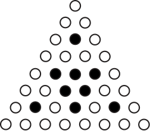

## Part A: Each correct answer is worth 5.

### Problem 1
A rectangle has width 2 cm and length 3 cm. 

<figure style="display: flex; flex-direction: column; align-items: center;">
    
</figure>

The area of the rectangle is

$\textbf{(A) }2 \text{ cm}^2\qquad\textbf{(B) }9 \text{ cm}^2\qquad\textbf{(C) }5 \text{ cm}^2\qquad\textbf{(D) }36 \text{ cm}^2\qquad\textbf{(E) }6 \text{ cm}^2$

### Problem 2
The expression $2+3\times 5+2$ equals

$\textbf{(A) }19\qquad\textbf{(B) }27\qquad\textbf{(C) }35\qquad\textbf{(D) }17\qquad\textbf{(E) }32$

### Problem 3
The number equal to 25% of 60 is

$\textbf{(A) }10\qquad\textbf{(B) }15\qquad\textbf{(C) }20\qquad\textbf{(D) }12\qquad\textbf{(E) }18$

### Problem 4
When $x = 2021$, the value of $\frac{4x}{x+2x}$ is

$\textbf{(A) }\frac{3}{4}\qquad\textbf{(B) }\frac{4}{3}\qquad\textbf{(C) }2021\qquad\textbf{(D) }2\qquad\textbf{(E) }6$

### Problem 5
Which of the following integers cannot be written as a product of two integers, each greater than 1?

$\textbf{(A) }6\qquad\textbf{(B) }27\qquad\textbf{(C) }53\qquad\textbf{(D) }39\qquad\textbf{(E) }77$

### Problem 6
A square piece of paper has a dot in its top right corner and is lying on a table. The square is folded along its diagonal, then rotated $90^\circ$ clockwise about its centre, and then finally unfolded, as shown.

<figure style="display: flex; flex-direction: column; align-items: center;">
    
</figure>

The resulting figure is

$\textbf{(A) }$ $\qquad\textbf{(B) }$ $\qquad\textbf{(C) }$ $\qquad\textbf{(D) }$ $\qquad\textbf{(E) }$

### Problem 7
For which of the following values of $x$ is $x$ greater than $x^2$?

$\textbf{(A) } x = -2\qquad\textbf{(B) } x = -\frac{1}{2}\qquad\textbf{(C) } x = 0\qquad\textbf{(D) } x = \frac{1}{2}\qquad\textbf{(E) } x = 2$

### Problem 8
The digits in a two-digit positive integer are reversed. The new two-digit integer minus the original integer equals 54. What is the positive difference between the two digits of the original integer?

$\textbf{(A) } 5\qquad\textbf{(B) } 7\qquad\textbf{(C) } 6\qquad\textbf{(D) } 8\qquad\textbf{(E) } 9$

### Problem 9
The line with equation $y = 2x - 6$ is translated upwards by 4 units. (That is, every point on the line is translated upwards by 4 units, forming a new line.) The $x$-intercept of the resulting line is

$\textbf{(A) } 3\qquad\textbf{(B) } \frac{1}{2}\qquad\textbf{(C) } 4\qquad\textbf{(D) } 1\qquad\textbf{(E) } 2$

### Problem 10
If $3^5 = 5$, the value of $3^{5+2}$ is

$\textbf{(A) } 10\qquad\textbf{(B) } 25\qquad\textbf{(C) } 2187\qquad\textbf{(D) } 14\qquad\textbf{(E) } 45$

---

## Part B: Each correct answer is worth 6.

### Problem 11
In the sum shown, $P$, $Q$ and $R$ represent three different single digits.

<figure style="display: flex; justify-content: center; align-items: center;">
    
</figure>

The value of $P + Q + R$ is

$\textbf{(A) } 13\qquad\textbf{(B) } 12\qquad\textbf{(C) } 14\qquad\textbf{(D) } 3\qquad\textbf{(E) } 4$

### Problem 12
How many of the 20 perfect squares $1^2, 2^2, 3^2, \dots, 19^2, 20^2$ are divisible by 9?

$\textbf{(A) } 2\qquad\textbf{(B) } 3\qquad\textbf{(C) } 4\qquad\textbf{(D) } 5\qquad\textbf{(E) } 6$

### Problem 13
In the diagram, each of $\triangle WXZ$ and $\triangle XYZ$ is an isosceles right-angled triangle. The length of $WX$ is $6\sqrt{2}$. The perimeter of quadrilateral $WXYZ$ is closest to

<figure style="display: flex; justify-content: center; align-items: center;">
    
</figure>

$\textbf{(A) } 18\qquad\textbf{(B) } 20\qquad\textbf{(C) } 23\qquad\textbf{(D) } 25\qquad\textbf{(E) } 29$

### Problem 14
Natascha cycles 3 times as fast as she runs. She spends 4 hours cycling and 1 hour running. The ratio of the distance that she cycles to the distance that she runs is

$\textbf{(A) } 12:1\qquad\textbf{(B) } 7:1\qquad\textbf{(C) } 4:3\qquad\textbf{(D) } 16:9\qquad\textbf{(E) } 1:1$

#### Solution

### Problem 15
Let $a$ and $b$ be positive integers for which $45a + b = 2021$. The minimum possible value of $a + b$ is

$\textbf{(A) } 44\qquad\textbf{(B) } 82\qquad\textbf{(C) } 85\qquad\textbf{(D) } 86\qquad\textbf{(E) } 130$

#### Solution

To reduce the number of batches we need to fill up a value, we first use use up as many as possible of the large batches, then we fill up the remainder with the small batches. Hence, we let $a=\lfloor \frac{2021}{45} \rfloor=44$, giving $b=2021-44\cdot 45=41$. Hence, the minimum possible value of $a+b$ is $44+41=\boxed{\textbf{(C) } 85}$.

### Problem 16
If $n$ is a positive integer, the notation $n!$ (read “$n$ factorial”) is used to represent the product of the integers from 1 to $n$. That is, $n! = n(n − 1)(n − 2) \cdots (3)(2)(1)$. For example, $4! = 4(3)(2)(1) = 24$ and $1! = 1$. If $a$ and $b$ are positive integers with $b > a$, the ones (units) digit of $b! - a!$ cannot be

$\textbf{(A) } 1\qquad\textbf{(B) } 3\qquad\textbf{(C) } 5\qquad\textbf{(D) } 7\qquad\textbf{(E) } 9$

#### Solution

Notice that the answer choices are all odd, so we assume $b!-a!\equiv 1 \pmod{2}$. But since $b>a>0$, then $b\ge 2$, such that $b!\equiv 0 \pmod{2}$. Then $a! \equiv 1 \pmod{2}$, which is only possible if $a!=1$. Also, notice for $b\ge 5$, we have $b!\equiv 0 \pmod{10}$, so we only need to check $b=2,3,4,5$. These give us residues of $2,6,4,0$ respectively, such that $b!-a!=b!-1\equiv 1,5,3,9 \pmod{10}$. So, the answer is $\boxed{\textbf{(D) } 7}$.

### Problem 17
The set $S$ consists of 9 distinct positive integers. The average of the two smallest integers in $S$ is 5. The average of the two largest integers in $S$ is 22. What is the greatest possible average of all of the integers of $S$?

$\textbf{(A) } 15\qquad\textbf{(B) } 16\qquad\textbf{(C) } 17\qquad\textbf{(D) } 18\qquad\textbf{(E) } 19$

#### Solution

Quickly bash it out: we want the extremal case, so take $(4,6,\dots,21,23)$ (take the inner integers to be as large as possible to maximize the space between them). Then, we can take the remaining $5$ integers to be $20,19,18,17,16$. The average becomes $\frac{23+21+20+19+18+17+16+6+4}{9}=\frac{144}{9}=\boxed{\textbf{(B) } 16}$.

### Problem 18
In the diagram, $\triangle PQR$ is an isosceles triangle with $PQ = PR$. Semi-circles with diameters $PQ$, $QR$ and $PR$ are drawn. The sum of the areas of these three semi-circles is equal to 5 times the area of the semi-circle with diameter $QR$. The value of $\cos(\angle PQR)$ is

<figure style="display: flex; justify-content: center; align-items: center;">
    
</figure>

$\textbf{(A) } \frac{1}{3}\qquad\textbf{(B) } \frac{1}{\sqrt{8}}\qquad\textbf{(C) } \frac{1}{\sqrt{12}}\qquad\textbf{(D) } \frac{1}{\sqrt{15}}\qquad\textbf{(E) } \frac{1}{\sqrt{10}}$

#### Solution

Let $x$ be the area of the big semi-circle, and $y$ the small semi-circle. We are given that $2x+y=5y$, or $x=2y$. Then the area ratio is $k^2=\frac{y}{x}=\frac{1}{2}$, yielding $k=\frac{QR}{PQ}=\frac{1}{\sqrt{2}}$. Then, the isosceles condition gives us $\cos(\angle PQR)=\frac{QR/2}{PR}=\frac{1}{2\sqrt{2}}=\boxed{\textbf{(B) } \frac{1}{\sqrt{8}}}$.

### Problem 19
The real numbers $x$, $y$ and $z$ satisfy the three equations
$$x+y=7$$
$$xz = -180$$
$$(x + y + z)^2 = 4$$
If $S$ is the sum of the two possible values of $y$, then $-S$ equals

$\textbf{(A) } 56\qquad\textbf{(B) } 14\qquad\textbf{(C) } 36\qquad\textbf{(D) } 34\qquad\textbf{(E) } 42$

#### Solution

Substituting equation $1$ into equation $3$, we get $(7+z)^2=4$, i.e. $z=-7\pm 2$, or $z\in \{-9,-5\}$. Working back from equation $2$ into equation $1$, we have $y=7+\frac{180}{z}$, so $y\in \{-13,-29\}$. Then the negative sum is $13+29=\boxed{\textbf{(E) } 42}$.

---

## Part C: Each correct answer is worth 8.

### Problem 20
In the diagram, $PRTY$ and $WRSU$ are squares. Point $Q$ is on $PR$ and point $X$ is on $TY$ so that $PQXY$ is a rectangle. Also, point $T$ is on $SU$, point $W$ is on $QX$, and point $V$ is the point of intersection of $UW$ and $TY$, as shown. If the area of rectangle $PQXY$ is 30, the length of $ST$ is closest to

<figure style="display: flex; justify-content: center; align-items: center;">
    
</figure>

$\textbf{(A) } 5\qquad\textbf{(B) } 5.25\qquad\textbf{(C) } 5.5\qquad\textbf{(D) } 5.75\qquad\textbf{(E) } 6$

#### Solution

Let $x:=RT=PY$, $y:=RS$. We wish to find $ST = \sqrt{x^2-y^2}$. Well, how do we approach this? Notice that we have a total of $4$ similar triangles, so this is the first thing we should try to exploit, as similar triangle tends to give the simplest solutions. In particular, notice that the simplest ones are $\triangle RQW \sim \triangle RST$. How to see this? Well, $QR=y$, and $PR$ is a simple rational function in terms of $x$ with denominator degree 1 due to the given area.

Notice that $PQ\cdot x=30$, so $PQ=\frac{30}{x}$. This means that $QR=PR-PQ=x-\frac{30}{x}=\frac{x^2-30}{x}$.

Now, we will witness something miraculous. We write from similarity $\frac{RQ}{RW}=\frac{RS}{RT}$:

$$\frac{\frac{x^2-30}{x}}{y}=\frac{y}{x}$$

Then $y^2=x^2-30$, such that $ST=\sqrt{x^2-y^2}=\sqrt{x^2-(x^2-30)}=\sqrt{30}\approx 5.47722558 \approx \boxed{\textbf{(C) } 5.5}$.

I got lucky, but how could we predicted this result before calculating to see that it cancels out? Well, we first notice that we can rotate $\triangle RQW$ into $\triangle RST$ by $90^\circ$ counterclockwise. This gives us the classic right angle altitude theorem configuration, where among others we have $RS^2=RQ\cdot RT$. But this is simply the area of $QRTX$, which is $30-x^2$. Visualizing Pythagora's, we clearly have that $ST^2=30$, so $ST=\sqrt{30}$.

Note: the official solutions used significant amounts of trig, and was quite involved and long, basically brute forcing into the result, which is why you should attempt similar triangles before trig bash.

### Problem 21
A function, $f$, has $f(2) = 5$ and $f(3) = 7$. In addition, $f$ has the property that
$$f(m) + f(n) = f(mn)$$
for all positive integers $m$ and $n$. (For example, $f(9) = f(3) + f(3) = 14$.) The value of $f(12)$ is

$\textbf{(A) } 17\qquad\textbf{(B) } 35\qquad\textbf{(C) } 28\qquad\textbf{(D) } 12\qquad\textbf{(E) } 25$

#### Solution

Notice that this is logarithmic properties, and we can deduce that $f(m^k)=kf(m)$. Hence, $f(12)=f(2^2\cdot 3)=2f(2)+f(3)=2\cdot 5+7=\boxed{\textbf{(A) } 17}$.

### Problem 22
An unpainted cone has radius 3 cm and slant height 5 cm. The cone is placed in a container of paint. With the cone's circular base resting flat on the bottom of the container, the depth of the paint in the container is 2 cm. When the cone is removed, its circular base and the lower portion of its lateral surface are covered in paint. The fraction of the total surface area of the cone that is covered in paint can be written as $\frac{p}{q}$ where $p$ and $q$ are positive integers with no common divisor larger than 1. What is the value of $p + q$?

<figure style="display: flex; justify-content: center; align-items: center;">
    
</figure>

(The lateral surface of a cone is its external surface not including the circular base. A cone with radius $r$, height $h$, and slant height $s$ has lateral surface area equal to $\pi rs$.)

$\textbf{(A) } 59\qquad\textbf{(B) } 61\qquad\textbf{(C) } 63\qquad\textbf{(D) } 65\qquad\textbf{(E) } 67$

#### Solution

The height is $h=\sqrt{s^2-r^2}=4$. The height of the pyramid uncovered by paint is $4-2=2$. Hence, the similarity ratio is $k=\frac{2}{4}=\frac{1}{2}$, so the area ratio is $k^2=\frac{1}{4}$. The ratio of areas is thus

$$\frac{\pi(r^2+rs-\frac{1}{4}rs)}{\pi(r^2+rs)}=1-\frac{\frac{1}{4}rs}{r(r+s)}=1-\frac{s}{4(r+s)}$$

$$=1-\frac{5}{4(3+5)}=\frac{27}{32}$$

Hence, we have $p+q=27+32=\boxed{\textbf{(A) }59}$.

### Problem 23
In Figure 1, three unshaded dots are arranged to form an equilateral triangle, as shown. Figure 2 is formed by arranging three copies of Figure 1 to form the outline of a larger equilateral triangle and then filling the resulting empty space with 1 shaded dot. For each integer $n > 2$, Figure $n$ is formed by first arranging three copies of Figure $n-1$ to form the outline of a larger equilateral triangle and then filling the resulting empty space in the centre with an inverted triangle of shaded dots.

  <figure style="text-align: center; margin: 0 10px;">
    
    <figcaption>Figure 1</figcaption>
  </figure>
  <figure style="text-align: center; margin: 0 10px;">
    
    <figcaption>Figure 2</figcaption>
  </figure>
  <figure style="text-align: center; margin: 0 10px;">
    
    <figcaption>Figure 3</figcaption>
  </figure>

The smallest value of $n$ for which Figure $n$ includes at least 100000 shaded dots is

$\textbf{(A) } 8\qquad\textbf{(B) } 9\qquad\textbf{(C) } 10\qquad\textbf{(D) } 11\qquad\textbf{(E) } 12$

#### Solution

I did recursion bash, but there's a more clever approach by complementary counting.

Notice that the number of unshaded dots simply multiplies by $3$ at each iteration. In addition, the side length is $2^n$, such that the total number of dots is $\frac{2^n (2^n+1)}{2}$ by triangular number. Hence, the number of shaded dots is $f(n):=2^{n-1}(2^n+1)-3^n$. Incrementing $n$, we will find that

$$f(8) = 26335 \le 100000 \le f(9) = 111645.$$

So, $n=\boxed{\textbf{(B) } 9}$.

### Problem 24
A pair of real numbers $(a,b)$ with $a^2 + b^2 \le \frac{1}{4}$ is chosen at random. If $p$ is the probability that the curves with equations $y = ax^2 + 2bx - a$ and $y = x^2$ intersect, then $100p$ is closest to

$\textbf{(A) } 65\qquad\textbf{(B) } 69\qquad\textbf{(C) } 53\qquad\textbf{(D) } 57\qquad\textbf{(E) } 61$

#### Solution

Notice that $a^2+b^2\le \left( \frac{1}{2} \right)^2$ is an equation for a disk of radius $\frac{1}{2}$ centered at the origin. The total area is $\pi r^2 = \pi \left( \frac{1}{2} \right)^2 = \frac{\pi}{4}$.

Now, for the intersection, set $ax^2+2bx-a=x^2$. Rearrange to get $(a-1)x^2+2bx-a=0$. Now, we recognize the quadratic equation with unknown coefficients where we need constraints on coefficients, so this is a hint to exploit the discriminant.

To have solutions, we need a nonnegative discriminant:

$$\Delta = (2b)^2-4(a-1)(-a)\ge 0$$

Simplifying, we recognize the inequality for a disk, yielding  $b^2 + a^2-a \ge 0$, or $b^2 + (a-\frac{1}{2})^2 \ge \frac{1}{4}$. Hence, this is a disk centered at $(\frac{1}{2},0)$ with radius $\frac{1}{2}$.

Taking the diagram from the official solutions:

<figure style="display: flex; justify-content: center; align-items: center;">
    
</figure>

Notice the equilateral triangle (side length $r=\frac{1}{2}$). We add 4 sectors of $60^\circ$ each, then subtract $2$ triangles. Hence, the bad area is

$$r^2 \left( 4 \cdot \frac{60^\circ}{360^\circ}\cdot \pi - 2 \cdot \frac{\sqrt{3}}{4} \right) = r^2 \left( \frac{2\pi}{3} - \frac{\sqrt{3}}{2} \right)$$

The probability is hence:

$$p = 1 - \frac{\frac{2\pi}{3}-\frac{\sqrt{3}}{2}}{\pi} \approx 0.608997781$$

Hence, we have that $100p \approx 60.8997781 \approx \boxed{\textbf{(E) } 61}$.

### Problem 25
Let $N$ be the number of triples $(x, y, z)$ of positive integers such that $x < y < z$ and $xyz = 2^2 \cdot 3^2 \cdot 5^2 \cdot 7^2 \cdot 11^2 \cdot 13^2 \cdot 17^2 \cdot 19^2$. When $N$ is divided by 100, the remainder is

$\textbf{(A) } 28\qquad\textbf{(B) } 88\qquad\textbf{(C) } 8\qquad\textbf{(D) } 68\qquad\textbf{(E) } 48$

#### Solution

Consider removing the order constraint, requiring only distinctness. Then, we divide by $6$ at the end.

To find distinctness, we can use a complementary approach. We will count the total number of triples, and then subtract the number of triples that are not distinct.

For the total, consider that each prime is independent of the others, and we have $8$ primes. So, let's consider one prime. We wish to distribute $2$ powers among $3$ bins: by stars and bars, there are $\binom{2+3-1}{3-1}=\binom{4}{2}=6$ ways to do this. Hence, $total = 6^8$.

For the bad cases, we require duplicates. Notice that since we are only given powers of $2$ per prime, then we can only split into $2$ duplicates at most. So, WLOG ($\times 3$) fix the first bin as the distinct value, with the second and third bins being duplicates. Then, we either give the power of $2$ to the first bin, or we split it between the other two bins. Hence, we have $3 \cdot 2^8$ bad cases.

Finally, the answer is

$$\frac{6^8-3\cdot 2^8}{6}=279808 \equiv \boxed{\textbf{(C) } 8} \pmod{100}$$