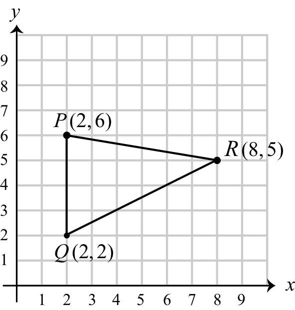
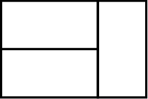
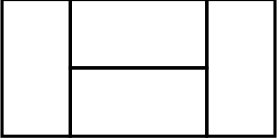
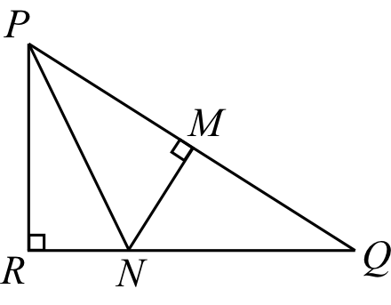
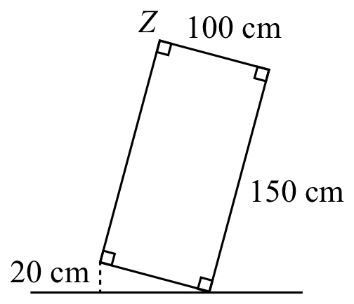

## Part A: Each correct answer is worth 5.

### Problem 1
The value of $6 + (3 \times 6) – 12$ is

$\textbf{(A) }6\qquad\textbf{(B) }9\qquad\textbf{(C) }12\qquad\textbf{(D) }18\qquad\textbf{(E) }24$

#### Solution
$6+18-12=\boxed{\textbf{(C) }12}$.

### Problem 2
The average (mean) of two numbers is 7. One of the numbers is 5. The other number is

$\textbf{(A) }6\qquad\textbf{(B) }4\qquad\textbf{(C) }3\qquad\textbf{(D) }8\qquad\textbf{(E) }9$

#### Solution
$\frac{x+5}{2}=7$, so that $x=2\cdot 7-5=\boxed{\textbf{(E) }9}$.

### Problem 3
Gauravi walks every day. One Monday, she walks 500 m. On each day that follows, she increases her distance by 500 m from the previous day. On what day of the week will she walk exactly 4500 m?

$\textbf{(A) }\text{Thursday}\qquad\textbf{(B) }\text{Friday}\qquad\textbf{(C) }\text{Tuesday}\qquad\textbf{(D) }\text{Monday}\qquad\textbf{(E) }\text{Wednesday}$

#### Solution
$\frac{4500-500}{500}=8\equiv 1 \pmod{7}$, so that $1+1=2$, giving $\boxed{\textbf{(C) }\text{Tuesday}}$.

### Problem 4
What is the largest number of squares with side length 2 that can be arranged, without overlapping, inside a square with side length 8?

$\textbf{(A) }8\qquad\textbf{(B) }32\qquad\textbf{(C) }16\qquad\textbf{(D) }64\qquad\textbf{(E) }4$

#### Solution

$\frac{8^2}{2^2}=4^2=\boxed{\textbf{(C) }16}$.

### Problem 5
One integer is selected at random from the following list of 15 integers:
$$1, 2, 2, 3, 3, 3, 4, 4, 4, 4, 5, 5, 5, 5, 5$$
The probability that the selected integer is equal to $n$ is $\frac{1}{3}$. What is the value of $n$?

$\textbf{(A) }1\qquad\textbf{(B) }2\qquad\textbf{(C) }3\qquad\textbf{(D) }4\qquad\textbf{(E) }5$

#### Solution
$15\cdot \frac{1}{3}=5$, and only $5$ has $5$ copies. Hence, $n=\boxed{\textbf{(E) }5}$.

### Problem 6
In the diagram, points $P(2,6)$, $Q(2,2)$ and $R(8,5)$ form a triangle.

<figure style="display: flex; justify-content: center; align-items: center;">
    
</figure>

The area of $\triangle PQR$ is

$\textbf{(A) }24\qquad\textbf{(B) }14\qquad\textbf{(C) }21\qquad\textbf{(D) }12\qquad\textbf{(E) }16$

#### Solution
$\frac{1}{2}(6-2)(8-2)=\frac{1}{2}(4)(6)=\boxed{\textbf{(D) }12}$.

### Problem 7
The expression $(1+2+3)\left(1 + \frac{1}{2} + \frac{1}{3}\right)$ is equal to

$\textbf{(A) }3\qquad\textbf{(B) }11\qquad\textbf{(C) }6\qquad\textbf{(D) }\frac{11}{6}\qquad\textbf{(E) }12$

#### Solution
$6(1+\frac{1}{2}+\frac{1}{3})=6+3+2=\boxed{\textbf{(B) }11}$.

### Problem 8
If $10x + y = 75$ and $10y + x = 57$ for some positive integers $x$ and $y$, the value of $x + y$ is

$\textbf{(A) }12\qquad\textbf{(B) }5\qquad\textbf{(C) }7\qquad\textbf{(D) }77\qquad\textbf{(E) }132$

#### Solution

Adding the equations, $11(x+y)=11\cdot 12$, so that $x+y=\boxed{\textbf{(A) }12}$.

### Problem 9
It takes Pearl 7 days to dig 4 holes. It takes Miguel 3 days to dig 2 holes. If they work together and each continues digging at these same rates, how many holes in total will they dig in 21 days?

$\textbf{(A) }35\qquad\textbf{(B) }22\qquad\textbf{(C) }12\qquad\textbf{(D) }26\qquad\textbf{(E) }28$

#### Solution

$21(\frac{4}{7}+\frac{2}{3})=3\cdot 4+2\cdot 7=12+14=\boxed{\textbf{(D) }26}$.

### Problem 10
If $2^{11} \times 6^5 = 4^x \times 3^y$ for some positive integers $x$ and $y$, then the value of $x + y$ is

$\textbf{(A) }10\qquad\textbf{(B) }11\qquad\textbf{(C) }12\qquad\textbf{(D) }13\qquad\textbf{(E) }14$

#### Solution
$2^{11} \times 6^5 = 2^{16} \times 3^5$, so $2x=16$ or $x=8$ and $y=5$. Hence, $x+y=\boxed{\textbf{(D) }13}$.

---

## Part B: Each correct answer is worth 6.

### Problem 11
Dhruv is older than Bev. Bev is older than Elcim. Elcim is younger than Andy. Andy is younger than Bev. Bev is younger than Cao. Who is the third oldest?

$\textbf{(A) }\text{Andy}\qquad\textbf{(B) }\text{Bev}\qquad\textbf{(C) }\text{Cao}\qquad\textbf{(D) }\text{Dhruv}\qquad\textbf{(E) }\text{Elcim}$

#### Solution

Draw a linear diagram. We have $E<B<D$ and $E<A<B$ and $B<C$, so that by transitivity $E<A<B$ and $B<C$ and $B<D$, so the third oldest is $\boxed{\textbf{(B) }\text{Bev}}$.

### Problem 12
Suppose that $d$ is an odd integer and $e$ is an even integer. How many of the following expressions are equal to an odd integer?
$$d+d \qquad (e + e) \times d \qquad d \times d \qquad d \times (e + d)$$

$\textbf{(A) }0\qquad\textbf{(B) }1\qquad\textbf{(C) }2\qquad\textbf{(D) }3\qquad\textbf{(E) }4$

#### Solution

Respectively: even, even, odd, odd, so $\boxed{\textbf{(C) }2}$.

### Problem 13
Seven identical rectangles are used to create two larger rectangles, as shown in Figure A and Figure B.

<figure style="display: flex; flex-direction: column; align-items: center;">
    
    <figcaption>Figure A</figcaption>
</figure>
<figure style="display: flex; flex-direction: column; align-items: center;">
    
    <figcaption>Figure B</figcaption>
</figure>

The ratio of the perimeter of Figure A to the perimeter of Figure B is

$\textbf{(A) }2:3\qquad\textbf{(B) }3:4\qquad\textbf{(C) }3:5\qquad\textbf{(D) }4:5\qquad\textbf{(E) }5:6$

#### Solution

WLOG let $s_A:=3+2=5$, $s_B:=4+2=6$, so that the ratio is $s_A:s_B=\boxed{\textbf{(E) }5:6}$.

### Problem 14
Zebadiah has 3 red shirts, 3 blue shirts, and 3 green shirts in a drawer. Without looking, he randomly pulls shirts from his drawer one at a time. He would like a set of shirts that includes either 3 of the same colour or 3 of different colours. What is the minimum number of shirts that Zebadiah has to pull out to guarantee that he has such a set?

$\textbf{(A) }4\qquad\textbf{(B) }3\qquad\textbf{(C) }6\qquad\textbf{(D) }5\qquad\textbf{(E) }7$

#### Solution

Consider setting aside the minimum required items, with $3$ of one color and $1$ of each of the other two. Hence, we set aside $5$ shirts, so the minimum required shirts by the Pigeonhole Principle is $9-5+1=\boxed{\textbf{(D) }5}$.

### Problem 15
A positive integer $a$ is input into a machine. If $a$ is odd, the output is $a + 3$. If $a$ is even, the output is $a + 5$. This process can be repeated using each successive output as the next input. For example, if the input is $a = 1$ and the machine is used three times, the final output is 12. If the input is $a = 15$ and the machine is used 51 times, the final output is

$\textbf{(A) }213\qquad\textbf{(B) }218\qquad\textbf{(C) }212\qquad\textbf{(D) }220\qquad\textbf{(E) }215$

#### Solution

Notice that under this mapping, odd goes to even and even goes to odd. Hence, we have $26$ applications on odd and $25$ on even. The final output is $15+3\cdot 26+5\cdot 25=\boxed{\textbf{(B) }218}$.

### Problem 16
The remainder when $111$ is divided by $10$ is $1$. The remainder when $111$ is divided by the positive integer $n$ is $6$. The number of possible values of $n$ is

$\textbf{(A) }5\qquad\textbf{(B) }8\qquad\textbf{(C) }7\qquad\textbf{(D) }6\qquad\textbf{(E) }4$

#### Solution

$n=111-6=105=3\cdot 5 \cdot 7$ works, and any of its factors greater than $6$ will also work. Hence, $(1+1)(1+1)(1+1)-|\{1,3,5\}|=8-3=\boxed{\textbf{(A) }5}$.

### Problem 17
An aluminum can in the shape of a cylinder is closed at both ends. Its surface area is $300 \text{ cm}^2$. If the radius of the can were doubled, its surface area would be $900 \text{ cm}^2$. If instead the height of the can were doubled, what would its surface area be?
(The surface area of a cylinder with radius $r$ and height $h$ is equal to $2\pi r^2 + 2\pi rh$.)

$\textbf{(A) }450 \text{ cm}^2\qquad\textbf{(B) }600 \text{ cm}^2\qquad\textbf{(C) }750 \text{ cm}^2\qquad\textbf{(D) }375 \text{ cm}^2\qquad\textbf{(E) }300 \text{ cm}^2$

#### Solution

We have:
$2\pi r(r+h)=300$
$2\pi (2r)(2r+h)=900$ or $2\pi r(2r+h)=450$
$2\pi r(r+2h)=?=2\pi r[3(r+h)-(2r+h)]=3\cdot 300-450=\boxed{\textbf{(A) }450}$.

### Problem 18
Aria and Bianca walk at different, but constant speeds. They each begin at 8:00 a.m. from the opposite ends of a road and walk directly toward the other's starting point. They pass each other at 8:42 a.m. Aria arrives at Bianca's starting point at 9:10 a.m. Bianca arrives at Aria's starting point at

$\textbf{(A) }9:30 \text{ a.m.}\qquad\textbf{(B) }9:35 \text{ a.m.}\qquad\textbf{(C) }9:40 \text{ a.m.}\qquad\textbf{(D) }9:45 \text{ a.m.}\qquad\textbf{(E) }9:50 \text{ a.m.}$

#### Solution

Here, the constant is distance. Let $v_A$ and $v_B$ be the speeds in units per minute, $t_B$ be Bianca's travel time. Then, we have $d=70v_A=t_Bv_B$, or $t_B=70\frac{v_A}{v_B}$. At $42$ minutes, we have $42v_A=(70-42)v_B=28v_B$, or $\frac{v_A}{v_B}=\frac{42}{28}=\frac{3}{2}$. Hence, $t_B=70\frac{3}{2}=105$ minutes $= 1h45$, so that the arrival time is $8h00+1h45=\boxed{\textbf{(D) }9:45 \text{ a.m.}}$.

### Problem 19
In the diagram, $\triangle PQR$ is right-angled at $R$, $PR = 12$, and $QR = 16$. Also, $M$ is the midpoint of $PQ$ and $N$ is the point on $QR$ so that $MN$ is perpendicular to $PQ$. 

<figure style="display: flex; flex-direction: column; align-items: center;">
    
</figure>

The area of $\triangle PNR$ is

$\textbf{(A) }21\qquad\textbf{(B) }17.5\qquad\textbf{(C) }36\qquad\textbf{(D) }16\qquad\textbf{(E) }21.5$

#### Solution

Notice that $\triangle PMN \cong \triangle QMN$ by SAS. Hence, by Pythagoras, $PR^2+RN^2=PN^2=QN^2$. Let $x:=RN$, so we end up with $12^2+x^2=(16-x)^2$, or $x=\frac{7}{2}$. Hence, the area is $\frac{1}{2}\cdot \frac{7}{2}\cdot 12=\boxed{\textbf{(A) }21}$.

### Problem 20
A sequence of numbers $t_1, t_2, t_3, \dots$ has its terms defined by $t_n = \frac{1}{n} - \frac{1}{n+2}$ for every integer $n \ge 1$. For example, $t_1 = \frac{1}{1} - \frac{1}{3} = \frac{2}{3}$ and $t_2 = \frac{1}{2} - \frac{1}{4} = \frac{1}{4}$. What is the largest positive integer $k$ for which the sum of the first $k$ terms (that is, $t_1+t_2+\dots+t_{k-1}+t_k$) is less than $1.499$?

$\textbf{(A) }2000\qquad\textbf{(B) }1999\qquad\textbf{(C) }2002\qquad\textbf{(D) }2001\qquad\textbf{(E) }1998$

#### Solution

This looks to be a telescoping problem. Since it's a finite sum, consider pairing the odd terms and the even terms together, rearranging the sum. Test some small cases to check that the pattern holds by engineering induction. Only the first 2 and last 2 terms remain:

$t_1+t_2+t_3+\dots+t_{k-1}+t_k=\frac{1}{1}+\frac{1}{2}-\frac{1}{k+1}-\frac{1}{k+2}<1.499$, or $0.001=\frac{1}{1000}<\frac{1}{k+1}+\frac{1}{k+2}=:s(k)$. Checking, we have $s(1999)=\frac{1}{2000}+\frac{1}{2001}<\frac{1}{1000}<s(1998)=\frac{1}{1999}+\frac{1}{2000}$, so $k=\boxed{\textbf{(E) }1998}$ is the maximum of $k$.

---

## Part C: Each correct answer is worth 8.

### Problem 21
Gustave has 15 steel bars of masses 1 kg, 2 kg, 3 kg, ..., 14 kg, 15 kg. He also has 3 bags labelled $A$, $B$, $C$. He places two steel bars in each bag so that the total mass in each bag is equal to $M$ kg. How many different values of $M$ are possible?

#### Solution

Draw a diagram of numbers 1 to 15, connect three pairs. The extremal cases are $(1,6),(2,5),(3,4)$ and $(10,15),(11,14),(12,13)$. We can increment in units by shifting the connections, so the answer is $25-7+1=\boxed{19}$.

For fun practice of an AMC 12 type question, let's also find the number of possible arrangements for this. Connect pairs with the same sum, so that we have $7$ pairs giving $16$, $7$ pairs giving $15$, $6$ pairs giving $14$, and so on until $2$ pairs giving $6$ and $5$. So $2(\binom{7}{3}+\binom{6}{3}+\binom{5}{3}+\binom{4}{3}+\binom{3}{3})=2\binom{8}{4}=56$ by hockey stick identity.

### Problem 22
A rectangle with dimensions 100 cm by 150 cm is tilted so that one corner is 20 cm above a horizontal line, as shown. To the nearest centimetre, the height of vertex $Z$ above the horizontal line is $(100 + x)$ cm. What is the value of $x$?

<figure style="display: flex; column-direction: column; align-items: center;">
    
</figure>

#### Solution

First instinct, notice the similar triangles. We have $\sin(\theta)=\frac{20}{100}=\frac{1}{5}$, so that the height is simply $20+150\cos \theta=20+150\cdot \sqrt{1-\left(\frac{1}{5}\right)^2}\approx 166.969385 \approx 167$, meaning $x=\boxed{67}$.

### Problem 23
For how many positive integers $k$ do the lines with equations $9x + 4y = 600$ and $kx - 4y = 24$ intersect at a point whose coordinates are positive integers?

#### Solution

Adding the equations, we get $x(k+9)=624=2^4\cdot 3\cdot 13$. From the first equation, $x\equiv 0 \pmod{4}$ and $y\equiv 0 \pmod{3}$, so let $x:=4m$, $y:=3n$. We can rewrite the equations.
$36m+12n=600$ or $3m+n=50$.
$4km-12n=24$ or $km-3n=8$.

We need to ensure that $x,y,k>0$, for which $m,n>0$ is sufficient. The added equation becomes $m(k+9)=2^2\cdot 3\cdot 13$, so we require $k+9>9$, eliminating $k=1,2,3,4,6$ from the factors of $2^2\cdot 3\cdot 13=156$. We notice that each of these solutions is valid, since $k\ge 12$ so that $x\le 13$, hence $3n=km-8=156-9m-8\ge 156-9\cdot 13-8=31>0$, and $n=50-3m\ge 50-3\cdot 13=11>0$.

Hence, the number of solutions is $(2+1)(1+1)(1+1)-5=\boxed{07}$.

### Problem 24
There are functions $f(x)$ with the following properties:
• $f(x) = ax^2 + bx + c$ for some integers $a, b$ and $c$ with $a > 0$, and
• $f(p) = f(q) = 17$ and $f (p+q) = 47$ for some prime numbers $p$ and $q$ with $p < q$.

For each such function, the value of $f (pq)$ is calculated. The sum of all possible values of $f (pq)$ is $S$. What are the rightmost two digits of $S$?

#### Solution

First, what's the goal? We want to find the sum of all possible values of $f(pq)=a(pq)^2+b(pq)+c$. Note that the coefficients are all integers, and $f(p+q)$ when expanded should yield some cross terms, so this is surely a factorization problem.

We also immediately notice the symmetry of $f(p)=f(q)=17$ for $p<q$. This means that the minimum value occurs at $\frac{p+q}{2}=\frac{-b}{2a}$ since $a>0$. We also get $-b=a(p+q)$.

So let's expand:
$f(p+q)=47=a(p+q)^2+b(p+q)+c=-b(p+q)+b(p+q)+c=c$.
Nice, so $c=47$.

We can likely cancel some terms by subtracting $f(p)$ and $f(q)$ from $f(p+q)$, and the $pq$ term will stay.
$f(p+q)=47=a(p+q)^2+b(p+q)+c=a(p^2+2pq+q^2)+b(p+q)+c$
$f(p)=17=ap^2+bp+c$
$f(q)=17=aq^2+bq+c$

$$f(p+q)-f(p)-f(q)=2apq-c$$

We thus have $c+f(p+q)-f(p)-f(q)=47-47-17-17=60=2apq$, or $apq=30$, yielding $a=\frac{30}{pq}$, meaning $p|30$ and $q|30$. We can have $(p,q)=(2,3),(2,5),(3,5)$. Respectively, since $b=-a(p+q)$, we have $(pq,a,b)=(6,5,-25),(10,3,-21),(15,2,-16)$.

We have $f(pq)=a(pq)^2+b(pq)+c=pq(pqa+b)+c$, so the sum of possible values is $S=3\cdot 47 + 6(6\cdot 5-25)+10(10\cdot 3-21)+15(15\cdot 2-16)=471 \equiv \boxed{71} \pmod{100}$.

### Problem 25
In the $3 \times 3$ grid shown, the central square contains the integer 5. The remaining eight squares contain $a, b, c, d, e, f, g, h$, which are each to be replaced with an integer from 1 to 9, inclusive.

$$
\begin{array}{|c|c|c|}
\hline
a & b & c \\\hline
d & 5 & e \\\hline
f & g & h \\\hline
\end{array}
$$

Integers can be repeated. There are $N$ ways to complete the grid so that the sums of the integers along each row, along each column, and along the two main diagonals are all divisible by 5.

What are the rightmost two digits of $N$?

#### Solution

Let's evaluate the degrees of freedom. We have the congruences mod $5$:

$$
\begin{cases}
a + h \equiv 0 \\
b + g \equiv 0 \\
c + f \equiv 0 \\
d + e \equiv 0 \\
a+b+c \equiv 0 \\
f+g+h \equiv 0 \\
a+d+f \equiv 0 \\
c+e+h \equiv 0 \\
\end{cases}
$$

Notice that if we, for instance, fix $a$, then $h$ is determined. If we then fix $b$, then $g$ is determined. Consequently, $c$ and $f$ will be determined, then $d$ and $e$ will also fall. Hence, we have $2$ degrees of freedom. WLOG, we fix $a$ and $b$ (but notice that this choice is arbitrary and symmetric). Our grid becomes $(\text{mod }5)$:

$$
\begin{array}{|c|c|c|}
\hline
a & b & -(a+b) \\\hline
-(2a+b) & 0 & 2a+b \\\hline
a+b & -b & -a \\\hline
\end{array}
$$

Notice that for integers from $1$ to $9$, we cover every residue mod $5$ twice except for $0$. In fact, if $a\equiv 0$, then $a=5$, and similarly for the rest. Let's consider the cases on the residues of $a,b,a+b,2a+b$.

Notice that if you set two values to $5$, then every other value must be $5$.

Let's consider the cases:
1. 2 values are $5$ (all values are $5$)
2. 1 value is $5$
3. 0 values are $5$

Case 1: 2 values are $5$.
We must fill the entire grid with $5$.
Subanswer 1: $1$

Case 2: 1 value is $5$.
WLOG ($\times 4$) fix $a=5$.

$$
\begin{array}{|c|c|c|}
\hline
0 & b & -b \\\hline
-b & 0 & b \\\hline
b & -b & 0 \\\hline
\end{array}
$$

Then, we have $4$ non-zero residues for $b$, and the remaining non-zero residues are determined. We have 2 possible associated values for each non-zero residue, yielding $4\cdot 4 \cdot 2^6=2^{10}$ grids.
Subanswer 2: $2^{10}=1024$

Case 3: 0 values are $5$.

$$
\begin{array}{|c|c|c|}
\hline
a & b & -(a+b) \\\hline
-(2a+b) & 0 & 2a+b \\\hline
a+b & -b & -a \\\hline
\end{array}
$$

We need: $a\not\equiv 0$, $b\not\equiv 0$, $a+b\not\equiv 0$, $2a+b\not\equiv 0$.
In other words, the residues are $a\in\{1,2,3,4\}$, $b\in\{1,2,3,4\}$, such that $b \not\equiv -a$, $b\not\equiv -2a$ (these residues are distinct, $-a\not\equiv -2a$ since $a\not\equiv 0$), so we have $4\cdot 2=8$ choices of residues before the rest is determined. Then, each of $8$ non-zero residues has $2$ value choices, so $8\cdot 2^8=2^{11}$ grids.
Subanswer 3: $2^{11}=2048$

Hence, the total is $N=1+1024+2048=3073\equiv \boxed{73} \pmod{100}$.