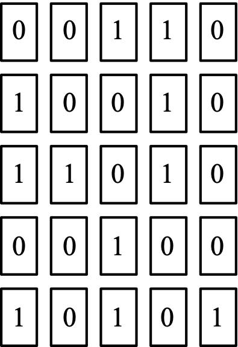
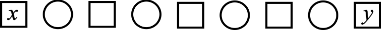
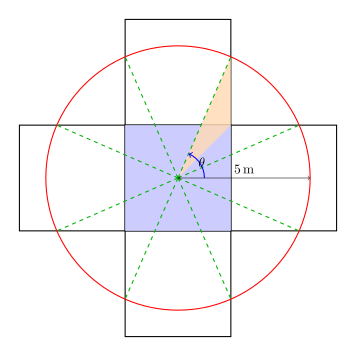

## Part A

### Problem 1
The value of $0.3 + 0.03$ is

$\textbf{(A) }0.303\qquad\textbf{(B) }0.6\qquad\textbf{(C) }3.3\qquad\textbf{(D) }0.33\qquad\textbf{(E) }0.06$

#### Solution

$\boxed{\textbf{(C) }3.3}$

### Problem 2
If $3 + x = 5$ and $-3 + y = 5$, then $x+y$ equals

$\textbf{(A) }4\qquad\textbf{(B) }16\qquad\textbf{(C) }6\qquad\textbf{(D) }12\qquad\textbf{(E) }10$

#### Solution

Add the equations. $x+y=\boxed{\textbf{(E) }10}$.

### Problem 3
When $x = 2$, the expression $2x^2 + 3x^2$ equals

$\textbf{(A) }14\qquad\textbf{(B) }10\qquad\textbf{(C) }12\qquad\textbf{(D) }22\qquad\textbf{(E) }20$

#### Solution

$5\cdot 2^2=\boxed{\textbf{(E) }20}$.

### Problem 4
The number of minutes in a week is closest to

$\textbf{(A) }100\qquad\textbf{(B) }1000\qquad\textbf{(C) }10000\qquad\textbf{(D) }100000\qquad\textbf{(E) }1000000$

#### Solution

$7 \frac{\text{days}}{\text{week}} \cdot 24 \frac{\text{hours}}{\text{day}} \cdot 60 \frac{\text{minutes}}{\text{hour}} = 10800$. Hence $\boxed{\textbf{(C) }10000}$.

### Problem 5
Ava's machine takes four-digit positive integers as input. When the four-digit integer $\overline{ABCD}$ is input, the machine outputs the integer $A \times B + C \times D$. For example, when the input is 1234, the output is $1 \times 2 + 3 \times 4 = 2 + 12 = 14$. When the input is 2023, the output is

$\textbf{(A) }0\qquad\textbf{(B) }2\qquad\textbf{(C) }3\qquad\textbf{(D) }6\qquad\textbf{(E) }8$

#### Solution

$2\cdot 0 + 2 \cdot 3 = \boxed{\textbf{(D) }6}$.

### Problem 6
Vivek is painting three doors. The doors are numbered 1, 2 and 3. Each door is to be painted one colour: either black or gold. One possibility is that door 1 is painted black, door 2 is painted gold, and door 3 is painted gold. In total, how many different ways can the three doors be painted?

$\textbf{(A) }8\qquad\textbf{(B) }7\qquad\textbf{(C) }5\qquad\textbf{(D) }4\qquad\textbf{(E) }3$

#### Solution

$2^3 = \boxed{\textbf{(A) }8}$.

### Problem 7
Snacks are purchased for 17 soccer players. Juice boxes come in packs of 3 and cost \$2.00 per pack. Apples come in bags of 5 and cost \$4.00 per bag. Danny buys packs of juice boxes and bags of apples so that every player gets a juice box and an apple. What is the minimum amount of money that Danny spends?

$\textbf{(A) }\$26.00\qquad\textbf{(B) }\$28.00\qquad\textbf{(C) }\$24.00\qquad\textbf{(D) }\$30.00\qquad\textbf{(E) }\$36.00$

#### Solution

$\lceil \frac{17}{3} \rceil \cdot 2 + \lceil \frac{17}{5} \rceil \cdot 4 = 6\cdot 2 + 4\cdot 4 = \boxed{\textbf{(B) }28}$.

### Problem 8
A bicycle trip is 30 km long. Ari rides at an average speed of 20 km/h. Bri rides at an average speed of 15 km/h. If Ari and Bri begin at the same time, how many minutes after Ari finishes the trip will Bri finish?

$\textbf{(A) }50 \text{ min}\qquad\textbf{(B) }40 \text{ min}\qquad\textbf{(C) }30 \text{ min}\qquad\textbf{(D) }20 \text{ min}\qquad\textbf{(E) }10 \text{ min}$

#### Solution

$30 (\frac{1}{15} - \frac{1}{20}) \cdot 60 = 30 \cdot (4-3) = \boxed{\textbf{(C) }30}$.

### Problem 9
Three tanks contain water. The number of litres in each is shown in the table below:

|        | Tank A | Tank B | Tank C |
| ------ | ------ | ------ | ------ |
| Litres | 3600 L | 1600 L | 3800 L |

Water is moved from each of Tank A and Tank C into Tank B so that each tank contains the same volume of water. How many litres of water are moved from Tank A to Tank B?

$\textbf{(A) }500 \text{ L}\qquad\textbf{(B) }600 \text{ L}\qquad\textbf{(C) }700 \text{ L}\qquad\textbf{(D) }800 \text{ L}\qquad\textbf{(E) }900 \text{ L}$

#### Solution

(Working in hundreds) $\frac{36+16+38}{3} = 30$. $36-30=6$. Hence $6\cdot 100 = \boxed{\textbf{(B) }600}$.

### Problem 10
Points A, B, C, and D lie along a line, in that order. If $AB : AC = 1 : 5$, and $BC : CD = 2 : 1$, then the ratio $AB : CD$ is equal to

$\textbf{(A) }1:1\qquad\textbf{(B) }1:2\qquad\textbf{(C) }1:3\qquad\textbf{(D) }2:5\qquad\textbf{(E) }3:5$

#### Solution

Draw a diagram. Let $AC = 10$ arbitrarily to hopefully remain in integers (seeing as $CD=BC/2$, I multiplied by 2 to ensure we would have less nasty fractions, but this turns out to be unnecessary, as $AC=5$ gives $BC=4$), so $AB=2$, then $BC=AC-AB=10-2=8$. Then $CD=4$, so $AB:CD=2:4=\boxed{\textbf{(B) }1:2}$.

---

## Part B

### Problem 11
At the start of this month, Mathilde and Salah each had 100 coins. For Mathilde, this was 25% more coins than she had at the start of last month. For Salah, this was 20% fewer coins than he had at the start of last month. The total number of coins that they had at the start of last month was

$\textbf{(A) }180\qquad\textbf{(B) }185\qquad\textbf{(C) }190\qquad\textbf{(D) }200\qquad\textbf{(E) }205$

#### Solution

$100(\frac{1}{1.25}+\frac{1}{0.8})=100(\frac{4}{5}+\frac{5}{4})=80+125=\boxed{\textbf{(E) }205}$.

### Problem 12
A rectangle has length 8 cm and width $\pi$ cm. A semi-circle has the same area as the rectangle. What is its radius?

$\textbf{(A) }4\sqrt{2} \text{ cm}\qquad\textbf{(B) }4 \text{ cm}\qquad\textbf{(C) }16 \text{ cm}\qquad\textbf{(D) }8 \text{ cm}\qquad\textbf{(E) }2 \text{ cm}$

#### Solution

$8\pi=\frac{1}{2}\pi r^2 \implies r=\boxed{\textbf{(B) }4}$.

### Problem 13
If $a(x + 2) + b(x + 2) = 60$ and $a + b = 12$, then $x$ is equal to

$\textbf{(A) }3\qquad\textbf{(B) }5\qquad\textbf{(C) }1\qquad\textbf{(D) }7\qquad\textbf{(E) }48$

#### Solution

$(a+b)(x+2)=60$
$12(x+2)=60$
$x+2=60/12=5$
$x=5-2=\boxed{\textbf{(A) }3}$.

### Problem 14
A line with a slope of 2 and a line with a slope of -4 each have a y-intercept of 6. The distance between the x-intercepts of these lines is

$\textbf{(A) }2\qquad\textbf{(B) }6\qquad\textbf{(C) }\frac{3}{2}\qquad\textbf{(D) }\frac{3}{4}\qquad\textbf{(E) }\frac{9}{2}$

#### Solution

x-intercept 1: $0=2x+6 \implies x=-3$
x-intercept 2: $0=-4x+6 \implies x=\frac{3}{2}$
Distance: $|\frac{3}{2}-(-3)|=\boxed{\textbf{(E) }\frac{9}{2}}$.

### Problem 15
A sequence has 101 terms, each of which is a positive integer. If a term, $n$, is even, the next term is equal to $\frac{n}{2} + 1$. If a term, $n$, is odd, the next term is equal to $\frac{n+1}{2}$. For example, if the first term is 7, then the second term is 4 and the third term is 3. If the first term is 16, the 101st term is

$\textbf{(A) }1\qquad\textbf{(B) }2\qquad\textbf{(C) }3\qquad\textbf{(D) }4\qquad\textbf{(E) }5$

#### Solution

$16,9,5,3,2,2,2,\dots,\boxed{\textbf{(B) }2}.$

### Problem 16
Twenty-five cards are randomly arranged in a grid, as shown. 

    

Five of these cards have a 0 on one side and a 1 on the other side. The remaining twenty cards either have a 0 on both sides or a 1 on both sides. Loron chooses one row or one column and flips over each of the five cards in that row or column, leaving the rest of the cards untouched. After this operation, Loron determines the ratio of 0s to 1s facing upwards. No matter which row or column Loron chooses, it is not possible for this ratio to be

$\textbf{(A) }12:13\qquad\textbf{(B) }2:3\qquad\textbf{(C) }9:16\qquad\textbf{(D) }3:2\qquad\textbf{(E) }16:9$

#### Solution

Current number of $0$'s: $14$.
Current number of $1$'s: $11$.
We can reach any consecutive state $(n,25-n)$ to $(n+1,25-n-1)$ by changing a single two-faced card to a one-faced card or vice versa. Hence, consider the extremal cases:
Max number of $0$'s in a single row/column: $4$.
Max number of $1$'s in a single row/column: $3$.

Hence, we could flip $4$ $0$'s, giving $(10,15)$, or flip $3$ $1$'s, giving $(17,8)$. It is not possible to reach $\boxed{\textbf{(C) } 9:16}$.

### Problem 17
The positive divisors of 6 are 1, 2, 3, 6. The sum of the positive divisors of 1184 is

$\textbf{(A) }2394\qquad\textbf{(B) }2396\qquad\textbf{(C) }2398\qquad\textbf{(D) }2400\qquad\textbf{(E) }2402$

#### Solution

$1184=2^5 \cdot 37.$
Hence the sum of the positive divisors is
$(1+2+2^2+2^2+2^3+2^4+2^5)(1+37)=(\frac{2^6-1}{2-1})(38)=(63)(38)=\boxed{\textbf{(A) }2394}$ (You can notice that $63\cdot 38 \equiv 3 \cdot 8 \equiv 4 \pmod{10}$).

### Problem 18
A robotic grasshopper jumps 1 cm to the east, then 2 cm to the north, then 3 cm to the west, then 4 cm to the south. After every fourth jump, the grasshopper restarts the sequence of jumps: 1 cm to the east, then 2 cm to the north, then 3 cm to the west, then 4 cm to the south. After a total of $n$ jumps, the position of the grasshopper is 162 cm to the west and 158 cm to the south of its original position. The sum of the squares of the digits of $n$ is

$\textbf{(A) }22\qquad\textbf{(B) }29\qquad\textbf{(C) }17\qquad\textbf{(D) }14\qquad\textbf{(E) }13$

#### Solution

I unfortunately misinterpreted the question when reading, which prevented me from solving it. So do make sure to read the question carefully. Use standard Cartesian conventions for cardinal directions.

We start with $162$ since it's the bigger number, so it will give the correct answer.

Horizontal movement: $\underbrace{1 - 3 + 1 - 3 + \dots + 1 - 3}_{m \text{ times}}= -162$

$-2m = -162 \implies m=81$ meaning $n=4m-1=323$.

Check that vertical movement is aligned:

$2-4+2-4+\dots=-158$

Either we can have $m=79$, which is too short, or we can cycle $+2-4+2=0$ in addition, which would give $n=4m+6=322$, which is valid as the last one for $n=323$ is $-3$. Hence, the answer is $3^2+2^2+3^2=\boxed{\textbf{(A) }22}$.

### Problem 19
If $x$ and $y$ are integers with $2x^2 + 8y = 26$, a possible value of $x-y$ is

$\textbf{(A) }-8\qquad\textbf{(B) }26\qquad\textbf{(C) }-16\qquad\textbf{(D) }22\qquad\textbf{(E) }30$

#### Solution

$x^2+4y=13$, hence $y=\frac{13-x^2}{4}$. This means that $x-y=x-\frac{13-x^2}{4}=\frac{1}{4}(x^2+4x-13)$. Notice that the vertex of the parabola is $-2$, and also $x^2 \equiv 1 \pmod 2 \implies x \equiv 1 \pmod 2$, so WLOG start from $-1$ and increase $x$ by $2$ per step. We can do this without a calculator more easily in this form, but in contest, just calculator bash.
$f(x)=\frac{x(x+4)-13}{4}$

$4f(-1)=-1(3)-13=-16, f(-1)=-4$
$4f(1)=1(5)-13=-8,f(1)=-2$
$4f(3)=3(7)-13=8,f(3)=2$
$4f(5)=5(9)-13=32,f(5)=8$
$4f(7)=7(11)-13=64,f(7)=16$
$4f(9)=9(13)-13=104,f(9)=26$
$4f(11)=11(15)-13=152,f(11)=38$

The answer is $\boxed{\textbf{(B) }26}$.

### Problem 20
If $n$ is a positive integer, the symbol $n!$ (which is read “$n$ factorial”) represents the product of the integers from 1 to $n$, inclusive. For example, $5! = (1)(2)(3)(4)(5)$ or $5! = 120$, which ends with exactly 1 zero. For how many integers $m$, with $1 < m < 30$, is it possible to find a value of $n$ so that $n!$ ends with exactly $m$ zeros?

$\textbf{(A) }30\qquad\textbf{(B) }27\qquad\textbf{(C) }28\qquad\textbf{(D) }24\qquad\textbf{(E) }25$

#### Solution

We know that ending with $0$ means it has a factor of $10$, and since there are more factors of $2$ than $5$ in $n!$, we know that $n!$ has as many $0$s as powers of $5$. Thus, we only care about the values where we add a power of $5$, i.e. $(5k)!$.

Consider which values are then skipped for $1<m<30$: this happens when we jump more than one power of $5$ at a time, so consider the multiples $5k$. We will construct a sequence looking at the powers of $5$ in $5k$, and consider the partial sums $1<m<30$ of the sequence.

The sequence is:

$1,1,1,1,2,1,1,1,1,2,1,1,1,1,2,1,1,1,1,2,1,1,1,1,3,\dots$

We can count how many values are skipped and take the complement. We see that $4\cdot (1+1+1+1+2)+4+3=31>30$, so we only have $4$ values skipped. Hence the answer is $30-2-4=\boxed{\textbf{(D) }24}$.

---

## Part C

### Problem 21
The integers 1, 2, 4, 5, 6, 9, 10, 11, 13 are to be placed in the circles and squares below with one number in each shape.

    

Each integer must be used exactly once and the integer in each circle must be equal to the sum of the integers in the two neighbouring squares. If the integer $x$ is placed in the leftmost square and the integer $y$ is placed in the rightmost square, what is the largest possible value of $x+y$?

#### Solution

Consider the largest possible value of $x$, so place the largest number $13$ in the first circle. This is indeed possible, so we get $11,13,2$. We also place the largest $y$ possible, so we have $1,10,9$ on the far right. This arrangement is possible using $11,13,2,6,4,5,1,10,9$, so the answer is $11+9=\boxed{20}$.

### Problem 22
If $x$ and $y$ are positive real numbers with $\frac{1}{x+y} = \frac{1}{x} - \frac{1}{y}$, what is the value of $\left(\frac{x}{y} + \frac{y}{x}\right)^2$?

#### Solution
Noticing expressions have the form $t+\frac{1}{t}$, this is a hint to exploit homogeneous polynomials. Let $t:=\frac{x}{y}$, $A := \left(\frac{x}{y} + \frac{y}{x}\right)^2 = \left(t + \frac{1}{t}\right)^2 = t^2 + \frac{1}{t^2} + 2$.

On the other hand, $\frac{1}{x} - \frac{1}{y}=\frac{x-y}{xy}$, so we end up with

$$1=\frac{x^2-y^2}{xy}=t-\frac{1}{t}$$

meaning that, squaring both sides, $1=t^2+\frac{1}{t^2}-2$, such that $t^2+\frac{1}{t^2}=3$. Hence, $A=3+2=\boxed{05}$.

Note: I feel like Waterloo purposefully writes long and poor solutions to problems, never leveraging substitutions or other tricks. If you check the official solution, it's very bashy. I don't know how they would expect us to finish the contest that way.

### Problem 23
For each positive integer $n$, define $s(n)$ to equal the sum of the digits of $n$. For example, $s(2023) = 2+0+2+3$. The number of integers $n$ with $100 \leq n \leq 999$ and $7 \leq s(n) \leq 11$ is $S$. What is the integer formed by the rightmost two digits of $S$?

#### Solution

Now it starts to get long and tedious. We will list out numbers who satisfy the condition $7\le s(n)\le 11$.

For $100\le n \le 199$:
$106,107,108,109$
$115,116,117,118,119$
$124,125,126,127,128$
$133,134,135,136,137$
...
$180,181,182$
$190,191$
Hence, for the $100$s, we have $4+6\cdot 5+4+3+2=43$ numbers.

For $200\le n \le 299$:
$205,206,207,208,209$
...
$250,251,252,253,254$
$260,261,262,263$
$270,271,272$
$280,281$
$290$
Hence, for the $200$s, we have $6\cdot 5+4+3+2+1$ numbers.

For $300\le n \le 399$:
$304,305,306,307,308$
$313,314,315,316,317$
...
$370,371$
$380$
Hence, for the $300$s, we have $5\cdot 5+4+3+2+1$ numbers.

Notice the pattern will keep repeating up to some point, so let's consider working from the end.

For $900\le n \le 999$:
$900,901,902$
$910,911$
$920$

So $900$s will have $3+2+1$, $800$s will have $4+3+2+1=10$, and $700$s and below will correctly have $4+3+2+1=10$ as well as the $k\cdot 5$ terms. Hence, we infer that the final sum is:

$S=43+5(6+5+4+3+2+1)+(8-2+1)\cdot 10+(3+2+1)=43+5\cdot 21+7\cdot 10+6=49+105+70\equiv \boxed{24} \pmod{100}$.

Looking at the official solution, they count by cases for $s(n)=7,8,9,10,11$ and then sum up, which does turn out to be nicer.

$(1+\dots+7)+(1+\dots+8)+(1+\dots+9)+(2+\dots+10)+(3+\dots+11)-2=28+36+45+54+63-2=224$.

where you subtract $2$ wrong cases because one of the last 2 digits is greater than $9$.

### Problem 24
Quadrilateral $ABCD$ has $\angle BCD = \angle DAB = 90^\circ$. The perimeter of $ABCD$ is 224 and its area is 2205. One side of $ABCD$ has length 7. The remaining three sides have integer lengths. The sum of the squares of the side lengths of $ABCD$ is $S$. What is the integer formed by the rightmost two digits of $S$?

#### Solution

The first thing we notice is that $ABCD$ is cyclic. WLOG, let $AB=7$ (notice the symmetry). Then let $BC=b$, $CD=c$, $DA=d$. We want to find $S = 7^2+b^2+c^2+d^2$. 

Here are our constraints:

1. Pythagora's: $7^2+d^2=b^2+c^2$
2. Perimeter: $7+b+c+d=224$
3. Area: $\frac{1}{2}(7d+bc)=2205$

There is an incredible amount of symmetry here, and we should do our best to exploit it. In particular, we see that we can probably solve for $d$ by matching it with constants against $b$ and $c$.

Notice that if we re-arrange the perimeter equation to isolate $b$ and $c$ against $d$, all terms should be known based on Pythagora's and area. Then, we could solve for $d$.

$$(d-217)^2=(-b-c)^2$$

$$d^2-2\cdot 217 + 217^2 = b^2+c^2+2bc$$

Substitute $b^2+c^2=7^2+d^2$ and $2bc=8820-14d$. The quadratic term nicely cancels out:

$$d^2-2\cdot 217d+217^2 = 7^2+d^2+8820-14d$$

Let's clean up this mess.

$$217^2-8820-49=420d$$

$$d=91$$

So $S=2(7^2+d^2)=2(49+91^2) = 16660 \equiv \boxed{60} \pmod{100}$.

### Problem 25
A cube has edge length 4 m. One end of a rope of length 5 m is anchored to the centre of the top face of the cube. The area of the surface of the cube that can be reached by the other end of the rope is $A$ $m^2$. What is the integer formed by the rightmost two digits of the integer closest to $100A$?

#### Solution

Let's unfold the cube to make it easier to visualize, with the top face at the origin. We can never reach the bottom face, so discard it. Drawing the path with constant length, we have a disk of radius $5$ that is cut off in some corners. So we need to determine the angle of the sectors.

    

Using trig, we get $\cos \theta = \frac{2}{5}$, so $\theta = \cos^{-1}\frac{2}{5} \approx 66.4218215^\circ$. The relevant angle is the complement, so $90-66.4218215 = 23.5781785^\circ$. Then, the area is 8 of these sectors plus 8 triangles filling the gaps, giving $8\cdot (\frac{90^\circ - \arccos\frac{2}{5}}{360^\circ} \cdot \pi (5)^2 + \frac{1}{2}(2)(\sqrt{5^2-2^2}-2))\approx 61.8122902$. Hence $100A\approx 6181.22902$, giving $6181$ when rounded to the nearest integer. The last two digits are $\boxed{81}$.