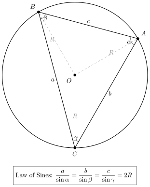
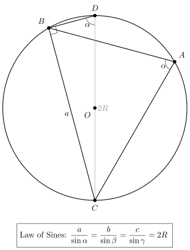

<figure style="display: flex; flex-direction: column; justify-content: center; align-items: center;">
    
    <figcaption>Illustration of the extended sine law </figcaption>
</figure>

<figure style="display: flex; flex-direction: column; justify-content: center; align-items: center;">
    
    <figcaption>Proof of the extended sine law using projection</figcaption>
</figure>
