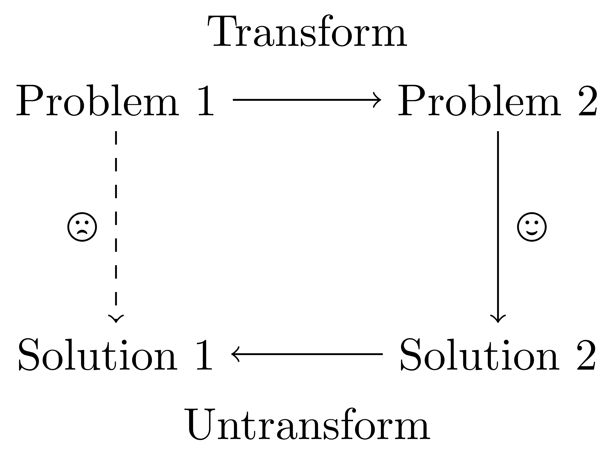

Whenever people hear about my enjoyment for mathematics, they often react with disbelief. To many, math is synonymous with dry textbooks and intimidating formulas—a subject to be endured, not enjoyed. Yet, these same individuals often light up at discussions of scientific discoveries or technological breakthroughs. They're captivated by stories of innovation and the real-world applications that shape our world? It’s not that math lacks depth or excitement, but rather how it’s taught.

In school, math is reduced to memorization: solving for x without understanding why it matters. We learn the 'what' and 'how,' but rarely the 'why.' Why do these processes work? Why does math describe the world so well? Why should we care about theorems or proofs? And how did we even get to these ideas in the first place?

This lack of focus on the 'why' strips math of its beauty. It’s like teaching literature by memorizing grammar rules without ever reading a novel. No wonder math feels dull—it’s like being handed a toolbox without knowing what to build.

At its core, mathematics is a deeply human endeavor. It's a language we’ve developed to describe and make sense of the world, from the motion of planets to the structure of DNA. To appreciate math, I want to answer the following questions from my perspective:

1. What is mathematics about?
2. Why does math have a negative stigma?
3. How to make matheatics accessible?

In the end, I hope it shines a light on the relevance of mathematics.

### 1. What is Mathematics About?

To me, mathematics is all about taking a step back, and realizing that each small blob of color that you see in front of you all comes together to form a beautiful landscape.

In other words, mathematics is about seeing the world from a more distant point of view to be able to gain a deeper understanding of the patterns that surround it.

Once you start seeing it this way, you realize that really every single area of mathematics, from the most elementary to the most sophisticated theories, emerged to be able to connect things that behave very similarly despite being vastly different in nature.

Let's start from its historial roots: counting. Today, the concept of numbers is so natural to us today that we can't imagine life without it. Yet, in the whole history of humanity, counting is a very recent invention: it dates to around 50000 years ago whereas the Earth was formed around 3.5 billion years ago.

If we take sticks and sheep, they are obviously completely different objects. However, if we take 3 sheep, then we can very naturally associate a correspondence to a tally of 3 sticks. So, in spite of the lack of a direct connection, there is a very natural pattern that we can form between the two, leading to the concept of counting and numbers.

This is very useful! Counting sheep in a pen is often hard since they are big, and it's often hard to keep track of each one while they constantly move around. Instead, we can reduce this problem to an easier one: each time we bring a sheep into the pen, we keep a tally of sticks corresponding to the number of sheep in the pen.

Now, when we need to know the number of sheep in the pen, we can simply look at the tally of sticks.

So, you may not have realized it, but numbers are one of the most basic example of abstraction in mathematics.

The idea of tying patterns between things that are unrelated on the surface is the very essence of mathematics. Therefore, mathematics relies on the fundamental ideas of "abstraction" and "generalization" of patterns.

Abstraction allows us to convert one problem into another potentially simpler or already solved problem, and generalization allows us to apply the same concept to a wider range of problems. This allows us to re-use existing knowledge and apply it to new situations! I call this the "detour approach".

- Figure: Diagram of the "detour approach" in mathematics.

So, if mathematics is so useful, why do so many people have a negative connotation of it?

### 2. Why does math have a negative stigma?

There are several factors that contribute to the negative stigma of mathematics.

#### 2.1. Mathematics is hard.

Let's face it: while there are ways to make learning math more enjoyable, the subject itself can be challenging. Its abstract and condensed nature often feels counterintuitive and difficult to grasp quickly. Learning math requires time and dedication to build a solid foundation, and it’s easy to get discouraged if things don’t “click” right away.

This applies to more generally to other subjects taught in school, not just mathematics. But because math underlies so many other fields like physics and chemistry, the effect is even more pronounced.

Many students experience pressure to get the right answer in math, which leads to a negative association with the topic. Math often feels binary—you’re either right or wrong. In other subjects, students can feel more freedom to express ideas and receive partial credit, but in math, getting the wrong answer can feel like a dead-end. This pressure can build up over time, leading to a fear of failure and avoidance of the subject altogether.

But this isn’t the core issue. People are willing to work hard on something when they feel it has a clear purpose or connection to their lives. Unfortunately, many people don’t experience this connection with math.

I like how Mark Rober described it in his Ted Talk: "The Super Mario Effect". When a kid plays a level in a game and they lose halfway through, they don't just give up and say "they weren't born for it". Instead, they stubbornly keep playing, and eventually they'll beat it and get more skilled. Clearly, the difficulty is not the problem, but the way it is framed.

#### 2.2. It feels irrelevant.

Often, mathematics is taught in isolation, without clear connections to real-world applications or other subjects. This can make it seem irrelevant or pointless to many students. When we fail to show how mathematical concepts apply to everyday life or other fields of study, it's easy for students to question, "When will I ever use this?" Sadly, the answer is often given as "because it's in the textbook, and it'll be useful later." This is a common problem in mathematics education, where people don't take the time to lay out the historical context and the problem that the presented theory was created to solve.

It is very unfortunate that mathematics is often taught at school in the following order:

- Present facts and formulas, theorems.
- If even bother, present proofs.
- Sometimes, vaguely mention the importance of the subject by only mentioning briefly some applications or connections to other areas of study.

The order is totally wrong, of course. Simply presenting facts and formulas without any context or explanation leads to a lack of understanding and appreciation for the subject. Every time, it feels like jumping to the end of a maze without ever showing the trajectory that led up to that point, not even the starting point.

#### 2.3. Cumulative knowledge.

Along with this, it is a very common phenomenon to teach topics in isolation. Many math classes and standardized tests prioritize quick, accurate answers over deep understanding. So they hyperfocus on just drilling specific formulas and theorems, rarely exploring all the ideas led up to it.

However, mathematics builds upon itself. If a student misses or misunderstands a fundamental concept, it can create a snowball effect, making future topics increasingly difficult to grasp. This can lead to a growing sense of frustration and confusion among a sea of different ideas to learn.

#### 2.4. Negative preconceptions.

There's a pervasive belief that mathematical ability is innate – you either have it or you don't. This fixed mindset can discourage students who struggle initially, making them feel that improvement is impossible.

In many societies, it is a common trend to make statements such as, "I'm not a math person". This normalization of math anxiety can reinforce negative attitudes towards the subject.

Worst of all, in my opinion, is the idea that math is somehow a "cold" subject with no creativity involved. This is the opposite of what mathematics is all about, as I discussed earlier. The very nature of mathematics is to think outside the box, literally abstract away from the world to be able to find patterns and connections between seemingly unrelated things.

I find that this mindset is very damaging to the subject, and more has to be done to change this. With many saying things like "Math involves creativity because you must hone your critical thinking skills blah blah blah", they are so vague that they don't actually convey the message they want to, sadly just further reinforcing the negative attitudes towards mathematics.

### 3. How to make matheatics accessible?

After listing the challenges of teaching mathematics in an engaging way, how do we overcome them? Here is an approach:

1. Present the problem statement and the historical context.

Before diving into the theory, it's important to understand the problem that the theory was created to solve. This helps students to see the bigger picture and understand the importance of the subject.

2. Demonstrate the relevance of the theory with real-world applications.

Once the theory is presented, it's important to show how it applies to real-world situations. Beyond just mentioning the applications, it is valuable to take the time to not just present examples but actually explain high-level details and use real-world data to illustrate the theory.

Many people list some applications vaguely and move on quickly, which honestly just leads to even poorer results because it just further overloads the listener with information without actually connecting it to the topic, leaving them confused.

3. Use technology to make learning more interactive.

There are often many technologies and tools that can be used to make learning math more engaging. However, they are often neglected in favor of more traditional methods because "the student won't learn to do it by themselves".

This is just stupid. By showing that there exist things to reduce their workload, there is less friction to learn the actual underlying content. You need to give people a taste of what is possible so they get excited about learning the subject.

So, tell people about existing technologies for every topic they learn, like using graphing calculators such as Desmos to graph functions, or using online calculators such as Wolfram Alpha to solve equations. If you don't know about such tools, then go out of your way to find some and introduce them, and encourage people to go look for more.

Of course, this might incentivize certain people to just use the tools without understanding the underlying concepts. This is why it is useful to create tests where these tools are not accessible to ensure people are actually learning the content, because the mere fact of interacting with the math through proofs and problems reinforces intuition vital to understanding the subject.