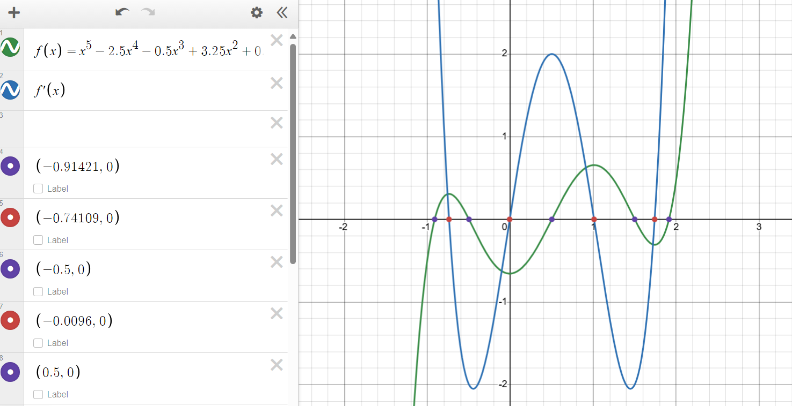
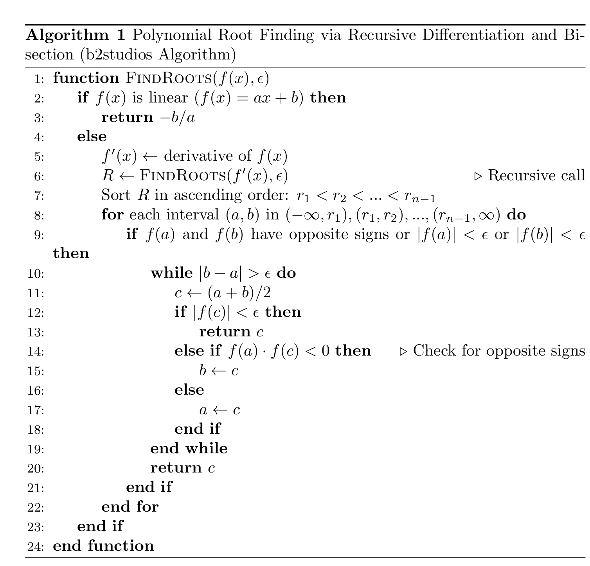
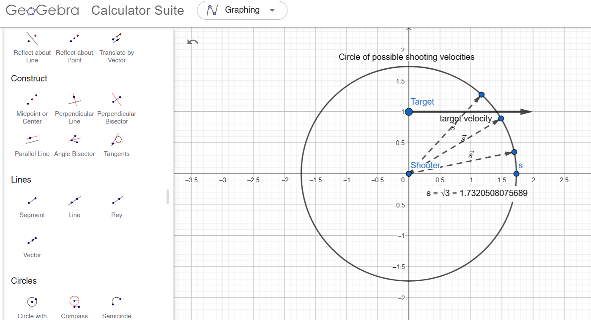

In his video titled [Cannons that Never Miss](https://www.youtube.com/watch?v=aKd32I0uwAQ), YouTuber [b2studios](https://www.youtube.com/@b2stud) developed an algorithm for finding real roots of polynomials.

Essentially, we are relying on the bisection method, but the main trick provided by b2studios is a simple and effective heuristic for identifying intervals isolating the roots.

The way this is done is that we compute the derivative and the polynomial \( p'(x) \) of the original polynomial \( p(x) \). Then, the assumption is that each root of \( p'(x) \) lies between two consecutive roots of \( p(x) \).



To express this more precisely, here is a mathematical definition of what I'll call the **interlacing property**:

> Given a univariate polynomial \( p(x) \), we say that it **interlaces** with another polynomial \( q(x) \) if their roots alternate on the real number line. Specifically, if \( p(x) \) has roots \( p_1 < p_2 < \cdots < p_k \) and \( q(x) \) has roots \( q_1 < q_2 < \cdots < q_{k-1} \), then the interlacing condition requires that:
\[
p_1 < q_1 < p_2 < q_2 < \cdots < p_{k-1} < q_{k-1} < p_k.
\]

In this formulation, we are assuming that each order of derivative \( p^{(k)}(x) \) interlaces with the next order \( p^{(k+1)}(x) \) until the highest order becomes an affine function \( p^{(n-1)}(x) = ax + b \).

Here is a formulation of the algorithm. The Python implementation can be found in the [Appendix](#python-implementation).



Here is the algorithm written in KaTeX if the image doesn't load: 

\(
\textbf{Algorithm: Polynomial Root Finding via Recursive Differentiation and Bisection} \\
\textbf{Input:} \text{ A polynomial function } f(x) \text{ of degree } n \ge 1. \text{ A desired precision } \epsilon > 0. \\
\textbf{Algorithm:} \\
\textbf{Function} \text{FindRoots}(f(x), \epsilon) \\
\quad \textbf{1. Recursive Differentiation:} \\
\quad \quad \textbf{Base Case: If } f(x) \text{ is linear } (f(x) = ax + b): \\
\quad \quad \quad \textbf{Return } -b/a \\
\quad \quad \textbf{Else:} \\
\quad \quad \quad f'(x) \gets \text{ derivative of } f(x) \\
\quad \quad \quad R \gets \text{FindRoots}(f'(x), \epsilon) \text{ (Recursive call)} \\
\quad \textbf{2. Root Interval Identification:} \\
\quad \quad \text{Sort } R \text{ in ascending order: } r_1 < r_2 < ... < r_{n-1} \\
\quad \quad \text{Create intervals: } (-\infty, r_1), (r_1, r_2), ..., (r_{n-1}, \infty) \\
\quad \textbf{3. Bisection Method for Each Interval } (a, b): \\
\quad \quad \textbf{Check for Root Existence: If } f(a) \text{ and } f(b) \text{ have opposite signs or } |f(a)| < \epsilon \text{ or } |f(b)| < \epsilon: \\
\quad \quad \quad \textbf{Bisection Iteration: While } |b - a| > \epsilon: \\
\quad \quad \quad \quad c \gets (a + b) / 2 \\
\quad \quad \quad \quad \textbf{If } |f(c)| < \epsilon: \\
\quad \quad \quad \quad \quad \textbf{Return } c \\
\quad \quad \quad \quad \textbf{Else If } f(a) \cdot f(c) < 0: \\
\quad \quad \quad \quad \quad b \gets c \\
\quad \quad \quad \quad \textbf{Else:} \\
\quad \quad \quad \quad \quad a \gets c \\
\quad \quad \quad \textbf{Return } c \\
\textbf{Output:} \text{ Approximate real roots of } f(x)
\)

### When Does the Algorithm Work?

Now that the algorithm has been covered, the question is: when does it work? In other words: 

> **Given a real, univariate polynomial \( p(x) \), under what conditions does each order of its derivatives interlace with the next?** For instance, when does \( p(x) \) interlace with \( p'(x) \), \( p'(x) \) interlace with \( p''(x) \), and so on?

When \( p(x) \) has only real roots, this interlacing property holds true for all derivatives if and only if all roots are simple (of multiplicity 1). The proof will be included in the appendix at the end.

However, if \( p(x) \) has complex roots (i.e., conjugate pairs), the analysis becomes more complicated and I have decided to stop pursuing it.

As a counterexample, consider \( p(x) = x^3 - 1 \). The roots are the third roots of unity, which are \( 1 \) and \( \frac{1}{2} + \frac{\sqrt{3}}{2}i \) and \( \frac{1}{2} - \frac{\sqrt{3}}{2}i \). Only one of them is real \( (x = 1) \). However, when taking its derivative, we obtain \( p'(x) = 3x^2 \), which only has the double root at \( x = 0 \). Therefore, the interlacing property does not hold for \( p(x) \) and \( p'(x) \).

To first deal with repeated roots, we can compute the greatest common divisor of the polynomial with its own derivative through the Euclidean algorithm. This new polynomial will in theory (assuming no problems from numerical errors, which seems to be fairly OK in ballistics) have only distinct roots. Then, to check this condition of having only real roots, we can apply Sturm's theorem on this processed polynomial to check if the number of real roots corresponds exactly to its degree, in which case the conditions are satisfied. A Python implementation of this can be found in the [Appendix](#python-implementation).

It seems like in practice, many ballistics scenarios with high enough fixed initial speed will satisfy this condition since, intuitively, having enough speed means you can easily shoot from different angles and still hit the target, so all solutions will exist. This was what happened with b2studios in his video, as the algorithm seemed to always work.

To have a multiple root means you are at the boundary of being able to hit the target, so a local minimum for the initial speed, which is an unlikely scenario. On the other hand, not having all positive real roots means you can't hit the target at all, which is possible if the target is too fast compared to the initial speed you set.

### Example Failure Case

[Back to Exact Taylor Projectile Motion](../../../Exact%20Taylor%20Projectile%20Motion.md#example-failure-case)

For instance, let's try to construct a scenario that will give us the simple \( x^2 + 1 \), which has no real roots. Taking the equations in [Exact Taylor Projectile Motion](../../../Exact%20Taylor%20Projectile%20Motion.md##2-undetermined-intersection-time-known-initial-vector-magnitude), let's say we want to solve

\[
\|t\vec v + \vec x\| = st
\]

for \( t \) given fixed scalar \( s \) and fixed vectors \( \vec v \) and \( \vec x \). Physically, this represents that we set an initial speed \( s \) and an initial position \( \vec x \) and velocity \( v \) for the target, and we want to find the time \( t \) at which the projectile hits the target so that we can then use this time to compute the direction of the initial shooting velocity \( \vec s \).

Squaring both sides, we can convert the squared norm into a dot product, which gives a quadratic equation in \( t \):

\[
(\vec v \cdot \vec v) t^2  + 2(\vec v \cdot \vec x) t  + \vec x \cdot \vec x = s^2 t^2
\]

Moving everything to one side:

\[
(\vec v \cdot \vec v - s^2) t^2  + 2(\vec v \cdot \vec x) t  + \vec x \cdot \vec x = 0
\]

Based on this, let's construct an example to obtain the polynomial \( t^2 + 1 \). This gives the system of equations:

\[
\begin{cases}
\vec v \cdot \vec v - s^2 = 1
\\
\vec v \cdot \vec x = 0
\\
\vec x \cdot \vec x = 1
\end{cases}
\]

Hence, we can construct a concrete example of a polynomial that has complex roots arising from ballistics: suppose we are working in 2 dimensions, we set

\[
\begin{cases}
\vec v := \begin{bmatrix} 2 \\ 0 \end{bmatrix}
\\
\vec x := \begin{bmatrix} 0 \\ 1 \end{bmatrix}
\\
s := \sqrt{3}
\end{cases}
\]

Here is a diagram of the situation in Geogebra:



Physically, no matter what the initial firing direction is, the projectile can never hit the target, it will go out of reach. In cases like these, the algorithm can fail.

## Resources

- YouTube: [Cannons that Never Miss](https://www.youtube.com/watch?v=aKd32I0uwAQ) by b2studios

## Appendix

### Proof of the Interlacing Property

Here is a proof that a real univariate polynomial \( p(x) \) with all real roots satisfies the interlacing property for all derivatives if and only if all roots are simple (of multiplicity 1).

Let \( p(x) = a_nx^n + a_{n-1}x^{n-1} + \dots + a_0 \) be a polynomial with \( n \) distinct (simple) real roots \( r_1 < r_2 < \dots < r_n \). We will use an inductive approach by showing that:

> 1. If \( p(x) \) has only simple real roots, then \( p'(x) \) has only simple real roots.
> 2. \( p(x) \) interlaces with \( p'(x) \) if and only if \( p(x) \) has only simple real roots.

Then, we can apply the theorem recursively to \( p'(x) \), and by induction it will hold for all derivatives.

Let's consider task 1.
> 1. If \( p(x) \) has only simple real roots, then \( p'(x) \) has only simple real roots.

First, since \( p(x) \) has degree \( n \), its derivative \( p'(x) \) has degree \( n-1 \). By the fundamental theorem of algebra, \( p'(x) \) has at most \( n-1 \) real roots counting multiplicity. If we let \( m \) be the number of distinct real roots of \( p'(x) \), then \( m \leq n-1 \).

By Rolle's theorem, for each pair of consecutive roots \( r_i, r_{i+1} \), there exists at least one \( r \in (r_i, r_{i+1}) \) between them such that \( f'(r) = 0 \). But if we repeat this for each interval \( (r_i, r_{i+1}) \) from \( 1 \) to \( n \), we have \( n - 1 \) consecutive pairs. This implies that \( p'(x) \) has at least \( n-1 \) distinct real roots, meaning \( n - 1 \leq m \).

But since we have \( n - 1 \leq m \leq n-1 \), we must have \( m = n-1 \). Therefore, \( p'(x) \) has only simple real roots. \( \square \)

Now, onto task 2.
> 2. \( p(x) \) interlaces with \( p'(x) \) if and only if \( p(x) \) has only simple real roots.

We break it down:

> \( p(x) \) has only simple real roots \( \Rightarrow \) \( p(x) \) interlaces with \( p'(x) \):

According to our earlier reasoning, each interval \( (r_i, r_{i+1}) \) of consecutive roots of \( p(x) \) contains exactly one simple real root, which implies that \( p(x) \) interlaces with \( p'(x) \). \( \square \)

> \( p(x) \) interlaces with \( p'(x) \) \( \Rightarrow \) \( p(x) \) has only simple real roots:

For sake of contradiction, suppose that \( p(x) \) has some root of multiplicity \( k > 1 \). Again letting \( m \) be the number of distinct real roots of \( p'(x) \), this means that \( m < n - 1 \). But in order to interlace the \( n \) distinct roots of \( p(x) \), there are exactly \( n - 1 \) slots to fill, implying \( m = n - 1 \). Therefore, we must have \( p(x) \) has only simple real roots. \( \blacksquare \)

### Python Implementation

#### b2studios Algorithm With Check for Distinct Real Roots

```py
# b2studios Algorithm for Polynomial Root Finding
import numpy as np
from sympy import symbols, Poly, div, gcd
import pandas as pd

# Step 1: Polynomial Root-Finding with Bisection and Cauchy Bound
def derivative(coeffs):
    degree = len(coeffs) - 1
    return [coeffs[i] * (degree - i) for i in range(degree)]

def cauchy_bound(coeffs):
    leading_coeff = coeffs[0]
    coeffs_abs = [abs(c / leading_coeff) for c in coeffs[1:]]
    return 1 + max(coeffs_abs)

def bisection_method(func, a, b, epsilon):
    while abs(b - a) > epsilon:
        c = (a + b) / 2
        func_c = func(c)
        if abs(func_c) < epsilon:
            return c
        elif func(a) * func_c < 0:
            b = c
        else:
            a = c
    return (a + b) / 2

def find_roots(coeffs, epsilon):
    if len(coeffs) == 2:
        a, b = coeffs
        return [-b / a]

    derivative_coeffs = derivative(coeffs)
    derivative_roots = find_roots(derivative_coeffs, epsilon)

    bound = cauchy_bound(coeffs)
    intervals = []

    if derivative_roots:
        intervals = [(-bound, derivative_roots[0])]
        intervals += [(derivative_roots[i], derivative_roots[i + 1]) for i in range(len(derivative_roots) - 1)]
        intervals += [(derivative_roots[-1], bound)]
    else:
        intervals = [(-bound, bound)]

    def poly_func(x):
        return sum(c * x**i for i, c in enumerate(reversed(coeffs)))

    roots = []
    for a, b in intervals:
        a_val, b_val = poly_func(a), poly_func(b)
        if a_val * b_val <= 0:
            root = bisection_method(poly_func, a, b, epsilon)
            if root is not None:
                roots.append(root)
    return roots

# Step 2: Sturm's Sequence for Distinct Roots Verification
def sturm_sequence(p):
    x = symbols('x')
    sequence = [p, p.diff()]
    while sequence[-1] != 0:
        _, remainder = div(sequence[-2], sequence[-1])
        sequence.append(-remainder)
    return sequence[:-1]

def count_sign_changes(sequence, value):
    if value == float('inf'):
        value = 1e12
    elif value == float('-inf'):
        value = -1e12

    signs = [np.sign(Poly(poly).eval(value)) for poly in sequence]
    return sum(
        1 for i in range(len(signs) - 1)
        if signs[i] * signs[i + 1] < 0
    )

def sturm_real_root_count(coeffs):
    x = symbols('x')
    sturm_seq = sturm_sequence(Poly(coeffs, x))
    inf_count = count_sign_changes(sturm_seq, float('inf'))
    neg_inf_count = count_sign_changes(sturm_seq, float('-inf'))
    return neg_inf_count - inf_count

def has_distinct_real_roots(coeffs):
    x = symbols('x')
    p = Poly(coeffs, x)
    p_prime = p.diff()
    return gcd(p, p_prime) == 1

# Step 3: Examples and Results
def polynomial_from_roots(roots):
    coeffs = [1]
    for root in roots:
        coeffs = np.polymul(coeffs, [1, -root])
    return coeffs.tolist()

examples = {
    "Example 1": [-4, -2, 1, 3],
    "Example 2": [-5, -1, 2, 4],
    "Example 3": [-10, -3, 0, 5, 7],
    "Example 4": [-6, -2, 0.5, 2.5, 4.5, 6],
}

results = []

for name, roots in examples.items():
    coeffs = polynomial_from_roots(roots)
    computed_roots = find_roots(coeffs, 1e-6)

    distinct_check = has_distinct_real_roots(coeffs)
    real_root_count = sturm_real_root_count(coeffs)

    results.append({
        "Name": name,
        "Original Roots": roots,
        "Coefficients": coeffs,
        "Computed Roots": computed_roots,
        "Has Distinct Real Roots": distinct_check,
        "Real Root Count (Sturm)": real_root_count,
        "Degree": len(coeffs) - 1
    })

print(pd.DataFrame(results).to_string())
```