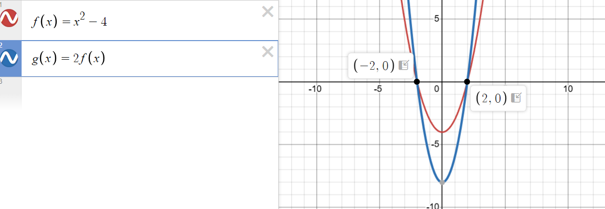
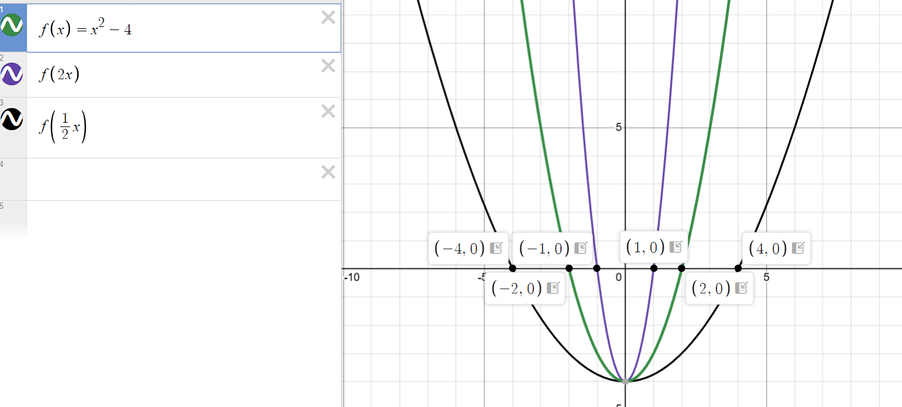
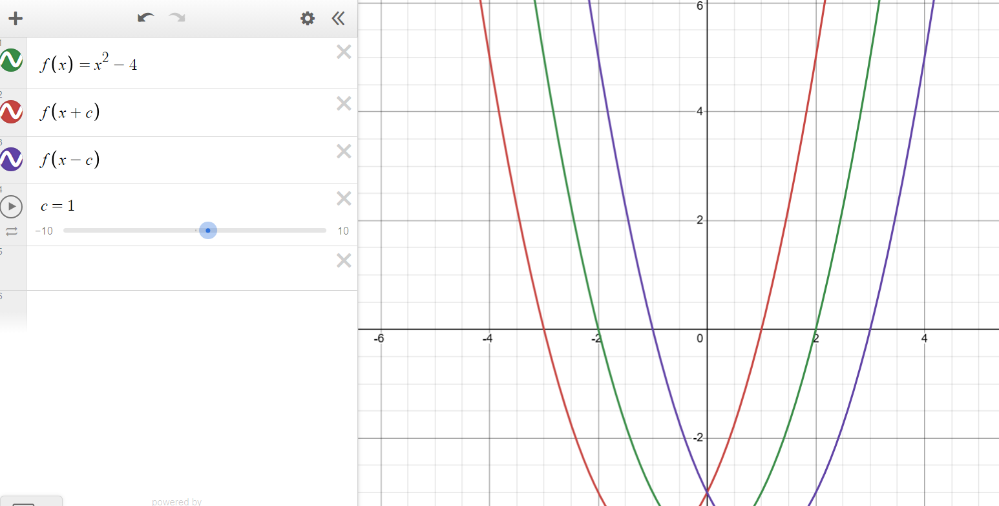

This is a refresher of some basic concepts in Algebra 2 that are useful for interval arithmetic.

A useful site for live graphing is [Desmos](https://www.desmos.com/calculator).

Our goal is to determine the effect of function manipulations on its roots and intervals of its output values.

## Function Manipulations

### Function Scaling

Let's say we have a function with roots, like \( f(x) = x^2 - 4 \). Then, what happens to the roots when we scale it? Well, \( f(x) = x^2 - 4 \) has roots at \( x = - 2 \) and \( x = 2 \). Remember that a definition of a root is that the function is equal to zero at that point. So if \( f(2) = 0 \) and we scale it by a constant, the function will still be equal to zero at the scaled point since \( c \cdot f(2) = c \cdot 0 = 0 \).

This means that roots of a function are unchanged when we scale its output. Hence, an interval containing a root will still contain the same root when we scale the function.

## Input Scaling

We can also scale the input of a function. For example, let's say we have a function with roots, like \( f(x) = x^2 - 4 \). Then, what happens to the roots when we scale its input? Again, \( f(x) = x^2 - 4 \) has roots at \( x = - 2 \) and \( x = 2 \).

Now, let's say we scale the input of \( f(x) \) by a constant, like \( 2 \).

It turns out that scaling the input by a constant factor \( c \) the position of the roots are scaled by \( \frac{1}{c} \). This makes sense, since if we transform a function from \( f(x) \) to \( f(2x) \), and let's say \( r \) was a root of \( f(x) \) so that \( f(r) = 0 \), then \( f(2(\frac{1}{2}r)) = f(r) = 0 \) and \( \frac{1}{2}r \) is a root of \( f(2x) \). Basically, we are undoing the scaling of the input by dividing by the scaling factor.

Intervals are affected similarly: an interval \( [a, b] \) containing a root \( r \) becomes \( [\frac{a}{c}, \frac{b}{c}] \) to contain \( \frac{r}{c} \) when we scale the input by a constant \( c \).

## Input Shifting

We can also shift the input of a function by adding a constant. Take \( f(x) = x^2 - 4 \) with roots at \( x = - 2 \) and \( x = 2 \). Suppose we add \( c \) to the input of \( f(x) \) to get \( f(x + c) = (x + c)^2 - 4 \).

Then, the roots of \( f(x + c) \) are \( x + c = - 2 \) and \( x + c = 2 \), so the new roots are found at \( x = - 2 - c \) and \( x = 2 - c \). 

In other words, adding a constant \( c \) to the input of a function \( f(x) \) shifts the graph horizontally by \( -c \) units. Equivalently, subtracting \( c \) from the input \( f(x) \) shifts the graph horizontally by \( c \) units.

In technical jargon, the input shifting is referred to as a Taylor shift.

## Further References

- [MathsIsFun](https://www.mathsisfun.com/sets/function-transformations.html)
- [Khan Academy](https://www.khanacademy.org/math/algebra2/x2ec2f6f830c9fb89:transformations)
- [PlanetCalc for calculating Taylor shifts](https://planetcalc.com/7726/)